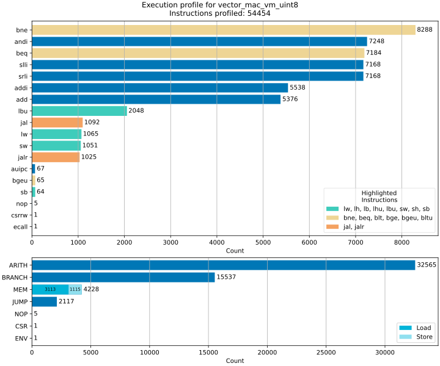
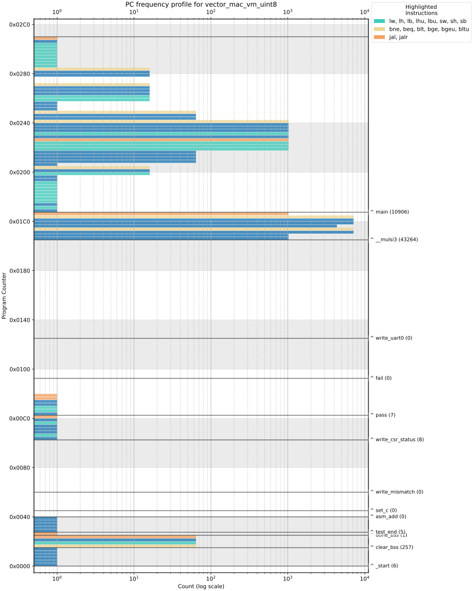

# RISC-V ISA simulator

Emulation of the RISC-V RV32I_zicsr

Features:
1. Compact single line logging of the executed instructions
2. Runtime disassembly of instructions, matching GCC's `objdump`, optionally using ABI format
3. Detailed logging with RF dump on each instruction, and DMEM access result (for loads/stores)
4. Runtime instruction type profiling and stack usage
5. Runtime PC & stack trace
6. UART peripheral (as output, or output and input)
7. Exposed functions for single step execution (for RTL verification through DPI wrapper)
8. HW performance estimations based on the profiled data

Further analysis and visualization is enabled through [python analysis scripts](#analysis-scripts)

Emulator is used through DPI for verification of the Verilog implementation: [ama-riscv](https://github.com/AleksandarLilic/ama-riscv)

## Build and Run
``` bash
cd src
# With default Make switches
make -j
```
Run with previously [built RISC-V program binary](#risc-v-programs)
``` bash
./ama-riscv-sim ../sw/baremetal/vector_mac/vm_uint8.bin
```

`stdout` at the end of simulation
```
Inst Counter: 54454
    PC: 8000003c
    zero: 0x00000000  ra  : 0x800000e0  sp  : 0x8003fff0  gp  : 0x80000af0
    tp  : 0x00000000  t0  : 0x00000000  t1  : 0x00000000  t2  : 0x00000000
    s0  : 0x80040000  s1  : 0x00000000  a0  : 0x0033f700  a1  : 0x0033f700
    a2  : 0x00000010  a3  : 0x00000001  a4  : 0x00000000  a5  : 0x80000350
    a6  : 0x00000000  a7  : 0x00000000  s2  : 0x00000000  s3  : 0x00000000
    s4  : 0x00000000  s5  : 0x00000000  s6  : 0x00000000  s7  : 0x00000000
    s8  : 0x00000000  s9  : 0x00000000  s10 : 0x00000000  s11 : 0x00000000
    t3  : 0x00000001  t4  : 0x00000000  t5  : 0x00000000  t6  : 0x00000000
    0x0340 (mscratch): 0x0
    0x051e (tohost): 0x1
```

With profiler enabled, emulator also reports:
```
Profiler: instructions profiled: 54454
Profiler: max SP usage: 32
```

Optional outputs:  
`vector_mac_vm_uint8_exec.log` - [Execution Log](#execution-log) (optionally with disassembly)  
`vector_mac_vm_uint8_inst_profiler.json` - [Runtime profile](#profiled-instructions) of all executed instruction  
`vector_mac_vm_uint8_trace.bin` - [Runtime trace](#binary-trace) with each executed PC and SP usage  

> More details about building and running the simulator are available in [source README](./src/README.md)

## Execution outputs
Although the outputs are human readable (except for the binary trace), they are meant for further processing with [analysis scripts](#analysis-scripts)

### Execution log

Saved as `vector_mac_vm_uint8_exec.log`  
Compact, one line per instruction
```
80000000: 00040117 auipc sp,0x40
80000004: 00010113 addi sp,sp,0
80000008: 00001197 auipc gp,0x1
8000000c: ae818193 addi gp,gp,-1304
80000010: 82018513 addi a0,gp,-2016
80000014: 86018593 addi a1,gp,-1952
80000018: 00b57863 bgeu a0,a1,80000028
8000001c: 00050023 sb zero,0(a0)
80000020: 00150513 addi a0,a0,1
80000024: ff5ff06f jal zero,80000018
80000018: 00b57863 bgeu a0,a1,80000028
8000001c: 00050023 sb zero,0(a0)
80000020: 00150513 addi a0,a0,1
80000024: ff5ff06f jal zero,80000018
...
```

Or detailed:
```
80000000: 00040117 auipc sp,0x40
    PC: 80000000
    zero: 0x00000000  ra  : 0x00000000  sp  : 0x80040000  gp  : 0x00000000  
    tp  : 0x00000000  t0  : 0x00000000  t1  : 0x00000000  t2  : 0x00000000  
    s0  : 0x00000000  s1  : 0x00000000  a0  : 0x00000000  a1  : 0x00000000  
    a2  : 0x00000000  a3  : 0x00000000  a4  : 0x00000000  a5  : 0x00000000  
    a6  : 0x00000000  a7  : 0x00000000  s2  : 0x00000000  s3  : 0x00000000  
    s4  : 0x00000000  s5  : 0x00000000  s6  : 0x00000000  s7  : 0x00000000  
    s8  : 0x00000000  s9  : 0x00000000  s10 : 0x00000000  s11 : 0x00000000  
    t3  : 0x00000000  t4  : 0x00000000  t5  : 0x00000000  t6  : 0x00000000  
    0x0340 (mscratch): 0x0       
    0x051e (tohost): 0x0       

80000004: 00010113 addi sp,sp,0
    PC: 80000004
    zero: 0x00000000  ra  : 0x00000000  sp  : 0x80040000  gp  : 0x00000000  
    tp  : 0x00000000  t0  : 0x00000000  t1  : 0x00000000  t2  : 0x00000000  
    s0  : 0x00000000  s1  : 0x00000000  a0  : 0x00000000  a1  : 0x00000000  
    a2  : 0x00000000  a3  : 0x00000000  a4  : 0x00000000  a5  : 0x00000000  
    a6  : 0x00000000  a7  : 0x00000000  s2  : 0x00000000  s3  : 0x00000000  
    s4  : 0x00000000  s5  : 0x00000000  s6  : 0x00000000  s7  : 0x00000000  
    s8  : 0x00000000  s9  : 0x00000000  s10 : 0x00000000  s11 : 0x00000000  
    t3  : 0x00000000  t4  : 0x00000000  t5  : 0x00000000  t6  : 0x00000000  
    0x0340 (mscratch): 0x0       
    0x051e (tohost): 0x0  

...

8000001c: 00050023 sb zero,0(a0)
    zero (0x0) -> mem[80000310]
    PC: 8000001c
    zero: 0x00000000  ra  : 0x00000000  sp  : 0x80040000  gp  : 0x80000af0
    tp  : 0x00000000  t0  : 0x00000000  t1  : 0x00000000  t2  : 0x00000000
    s0  : 0x00000000  s1  : 0x00000000  a0  : 0x80000310  a1  : 0x80000350
    a2  : 0x00000000  a3  : 0x00000000  a4  : 0x00000000  a5  : 0x00000000
    a6  : 0x00000000  a7  : 0x00000000  s2  : 0x00000000  s3  : 0x00000000
    s4  : 0x00000000  s5  : 0x00000000  s6  : 0x00000000  s7  : 0x00000000
    s8  : 0x00000000  s9  : 0x00000000  s10 : 0x00000000  s11 : 0x00000000
    t3  : 0x00000000  t4  : 0x00000000  t5  : 0x00000000  t6  : 0x00000000
    0x0340 (mscratch): 0x0
    0x051e (tohost): 0x0

...
```
Detailed log is indented such that it can be completely folded, making it as readable as compact version

### Profiled instructions
Saved as `vector_mac_vm_uint8_inst_profiler.json`  
Execution of each supported instruction is counted. Control flow instructions are furthrer broken down based on direction and if taken or not. Finally, stack usage is logged together with number of profiled instructions (`assert`ed in the source to match the number of executed instructions)

``` json
{
"add": {"count": 5376},
"sub": {"count": 0},
"sll": {"count": 0},
...
"beq": {"count": 7184, "breakdown": {"taken": 2832, "taken_fwd": 2832, "taken_bwd": 0, "not_taken": 4352, "not_taken_fwd": 4352, "not_taken_bwd": 0}},
"bne": {"count": 8288, "breakdown": {"taken": 7197, "taken_fwd": 0, "taken_bwd": 7197, "not_taken": 1091, "not_taken_fwd": 0, "not_taken_bwd": 1091}},
...
"_max_sp_usage": 32,
"_profiled_instructions": 54454
}
```

### Binary trace
Saved as `vector_mac_vm_uint8_trace.bin`  
Should be read as two-column raw binary file containing `['pc', 'sp']` of each executed instruction

## Analysis scripts
> More detailed description and examples are available in the [scripts README](./script/README.md)

### Execution visualization





### Backannotation of disassembly

Search for symbols in `.dasm` and map executed instructions to symbols (count shown in parethesis)
```
Symbols found in ../sw/baremetal/vector_mac/vm_uint8.dump:
0x01CC - 0x02AC: main (10906)
0x01A8 - 0x01C8: __mulsi3 (43264)
0x0128 - 0x01A4: write_uart0 (0)
0x00F4 - 0x0124: fail (0)
0x00C4 - 0x00F0: pass (7)
0x00A4 - 0x00C0: write_csr_status (8)
0x0060 - 0x00A0: write_mismatch (0)
0x0048 - 0x005C: set_c (0)
0x0040 - 0x0044: asm_add (0)
0x002C - 0x003C: test_end (5)
0x0028 - 0x0028: done_bss (1)
0x0018 - 0x0024: clear_bss (257)
0x0000 - 0x0014: _start (6)
```

And backannotate disassembly
```
80000000 <_start>:
    1 80000000:	00040117          	auipc	sp,0x40
    1 80000004:	00010113          	mv	sp,sp
    1 80000008:	00001197          	auipc	gp,0x1
    1 8000000c:	ae818193          	addi	gp,gp,-1304 # 80000af0 <__global_pointer$>
    1 80000010:	82018513          	addi	a0,gp,-2016 # 80000310 <c>
    1 80000014:	86018593          	addi	a1,gp,-1952 # 80000350 <__BSS_END__>

80000018 <clear_bss>:
   65 80000018:	00b57863          	bgeu	a0,a1,80000028 <done_bss>
   64 8000001c:	00050023          	sb	zero,0(a0)
   64 80000020:	00150513          	addi	a0,a0,1
   64 80000024:	ff5ff06f          	j	80000018 <clear_bss>

80000028 <done_bss>:
    1 80000028:	1a4000ef          	jal	800001cc <main>
...
```

### Annotation of the execution log with symbol names
Works for compact and detailed log (shown for compact)
```
<_start> at 80000000:
    80000000: 00040117 auipc sp,0x40
    80000004: 00010113 addi sp,sp,0
    80000008: 00001197 auipc gp,0x1
    8000000c: ae818193 addi gp,gp,-1304
    80000010: 82018513 addi a0,gp,-2016
    80000014: 86018593 addi a1,gp,-1952
<clear_bss> at 80000018:
    80000018: 00b57863 bgeu a0,a1,80000028
    8000001c: 00050023 sb zero,0(a0)
    80000020: 00150513 addi a0,a0,1
    80000024: ff5ff06f jal zero,80000018
    80000018: 00b57863 bgeu a0,a1,80000028
    8000001c: 00050023 sb zero,0(a0)
    80000020: 00150513 addi a0,a0,1
    80000024: ff5ff06f jal zero,80000018
...
```

### HW performance estimations
Estimation mostly focuses on static branch prediction benefits, though it takes into account all hw metrics specified in [config file](./script/hw_perf_metrics.json)

```
Branches total: 15537 out of 54454 total instructions (28.5% branches)
    Taken: 10030, Forwards: 2833, Backwards: 7197
    Not taken: 5507, Forwards: 4416, Backwards: 1091
    Predicted: 11613, Mispredicted: 3924, Accuracy: 74.7%
    Cycles: Original/With prediction: 72113/60500 (11613 cycles saved)
Potential app speedup: 16.1%
Estimated HW performance at 125MHz with 72113 cycles executed: CPI=1.32, exec time=576.9us, MIPS=94.4
Estimated HW performance at 125MHz with 60500 cycles executed: CPI=1.11, exec time=484.0us, MIPS=112.5
```

## Building RISC-V programs
Each program is in its own directory under with `Makefile` 
Simulation ends when emulator encounters `ecall` or `ebrake`

### Baremetal
Simple tests, most of them parametrizable (where applicable)

To build single test, e.g. `vector_mac`

```bash
cd sw/baremetal/vector_mac
```

with default settings
``` bash
make -j
```

or increase loop count for longer test (default is 1)
``` bash
make -j LOOPS=5
```

> More detailed description is available in the [baremetal README](./sw/baremetal/README.md)

### RISC-V ISA tests

``` bash
cd sw/riscv-isa-tests
```

Build all tests
```bash
# uses default DIR=riscv-tests/isa/rv32ui
make -j 
```

To add CSR test
``` bash
make -j DIR=modified_riscv-tests/isa/rv32mi/
```

## Gtest

Gtest suite is used as a way to prepare and run all available tests, while conveniently keeping PASS/FAIL status of each test

``` bash
cd test
make
```

The same `Makefile` can be used to prepare all tests specified under `test/testlist.json`
``` bash
make prepare
```
