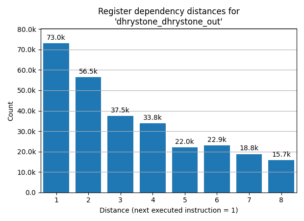
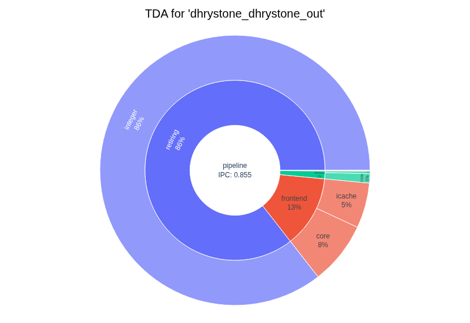
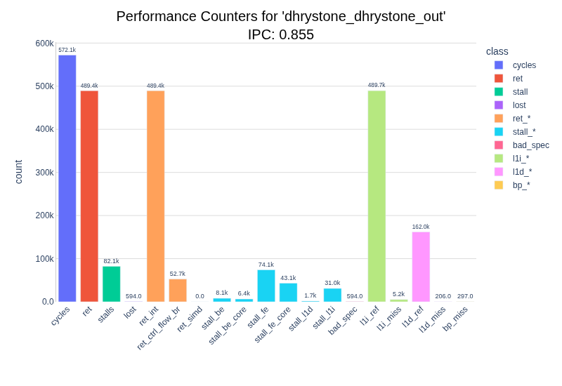
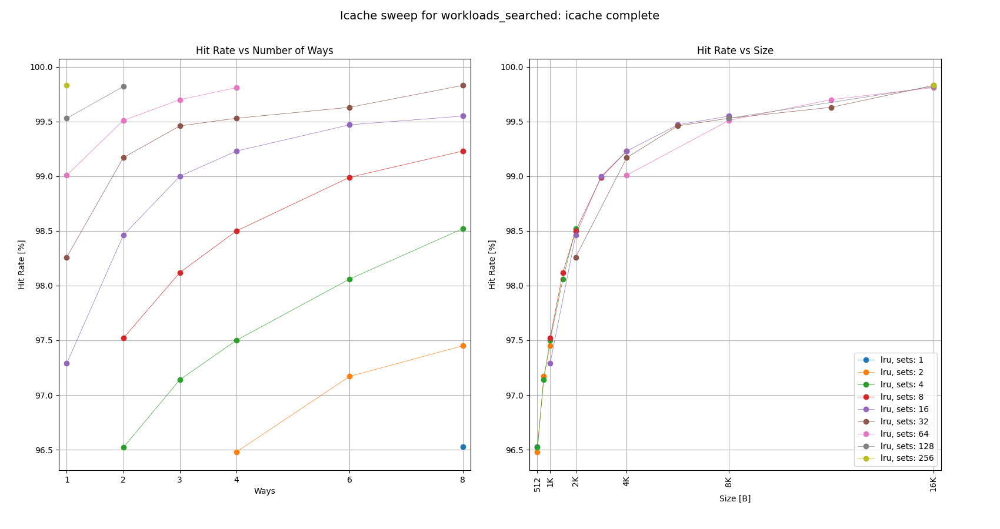
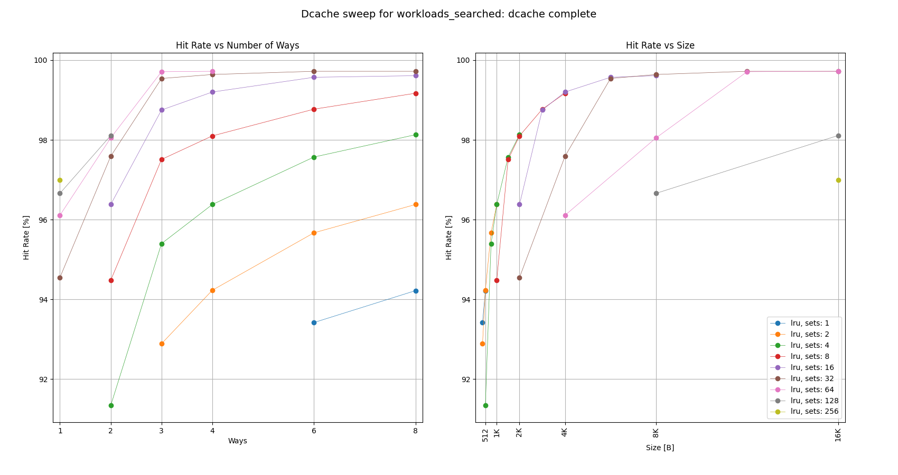
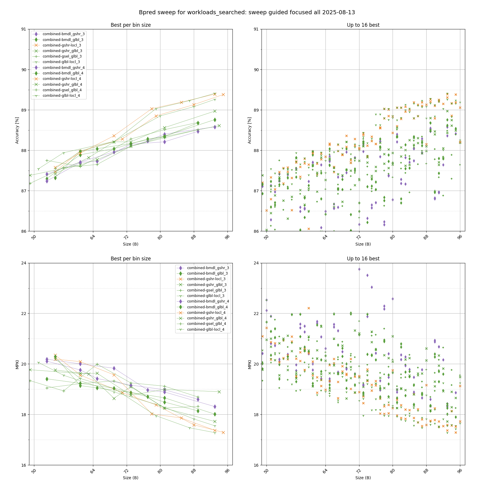
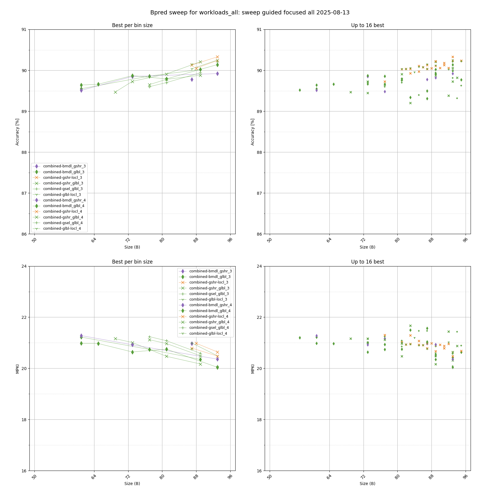

# RISC-V ISA simulator

C++ Instruction Set Simulator for RISC-V RV32IMC & custom SIMD instructions with cache and branch predictor models, C/ASM workloads, and Python analysis tools

- [RISC-V ISA simulator](#risc-v-isa-simulator)
- [Getting the project](#getting-the-project)
  - [Prerequisites](#prerequisites)
    - [Simulator build](#simulator-build)
    - [RISC-V software build (`sw/`)](#risc-v-software-build-sw)
    - [Analysis scripts (`script/`)](#analysis-scripts-script)
    - [Testing (`test/`)](#testing-test)
  - [Quick start](#quick-start)
- [Overview](#overview)
  - [Usage](#usage)
- [Example use-case: Dhrystone](#example-use-case-dhrystone)
  - [Running Dhrystone](#running-dhrystone)
    - [Notes on profiling](#notes-on-profiling)
  - [Execution log](#execution-log)
  - [Callstack](#callstack)
  - [Profiled instructions](#profiled-instructions)
  - [Execution trace and register file usage](#execution-trace-and-register-file-usage)
  - [Hardware models outputs](#hardware-models-outputs)
  - [Analysis scripts](#analysis-scripts)
    - [Flat profile](#flat-profile)
    - [FlameGraph](#flamegraph)
    - [Call Graph](#call-graph)
    - [Execution visualization](#execution-visualization)
    - [Hardware performance estimates](#hardware-performance-estimates)
    - [TDA](#tda)
- [Hardware model sweeps](#hardware-model-sweeps)
  - [Caches](#caches)
  - [Branch predictors](#branch-predictors)
- [Building RISC-V programs](#building-risc-v-programs)
  - [Baremetal](#baremetal)
    - [Benchmarks](#benchmarks)
    - [Quantized Neural Network](#quantized-neural-network)
  - [RISC-V ISA tests](#risc-v-isa-tests)
- [GTest](#gtest)
- [Building the Simulator](#building-the-simulator)
- [Building RISC-V Toolchain](#building-risc-v-toolchain)
- [Custom packed SIMD ISA](#custom-packed-simd-isa)
  - [Instruction list](#instruction-list)
  - [Instruction details](#instruction-details)
  - [Patching `binutils` to add support for custom instructions](#patching-binutils-to-add-support-for-custom-instructions)
  - [Patching `GCC` to add support for custom instructions](#patching-gcc-to-add-support-for-custom-instructions)
  - [Patching AAPG](#patching-aapg)

# Getting the project
Project relies on a few external libraries and tools. Clone recursively with
```sh
git clone --recurse-submodules git@github.com:AleksandarLilic/ama-riscv-sim.git
```

## Prerequisites

Submodules are pulled automatically with `--recurse-submodules`:
- [cxxopts](https://github.com/jarro2783/cxxopts)
- [ELFIO](https://github.com/serge1/ELFIO)
- [FlameGraph](https://github.com/brendangregg/FlameGraph)
- [gprof2dot](https://github.com/jrfonseca/gprof2dot)

### Simulator build
- GCC >= 10 (C++17, `gnu++17`)
- Make

### RISC-V software build (`sw/`)
- RISC-V GNU toolchain (check build notes under [Building RISC-V Toolchain](#building-risc-v-toolchain) chapter)
- AAPG (check patch notes under [Patching AAPG](#patching-aapg) chapter)

### Analysis scripts (`script/`)
Get `uv` first if needed  

On Ubuntu
```sh
curl -LsSf https://astral.sh/uv/install.sh | sh
```
On macOS
```sh
brew install uv
```

Set up the Python environment
``` sh
# install dependencies
uv sync
# activate when needed
source .venv/bin/activate
```

Other tools:
- Perl
- Graphviz

### Testing (`test/`)
- Google Test (`libgtest-dev` or equivalent)
- `lcov` and `genhtml` (for coverage reports)
- Optional: `valgrind`

## Quick start
To check that everything is available and working as expected:
1. build a single test
2. build the simulator
3. run the test and check the logs

``` sh
# build test
cd sw/baremetal/dhrystone
make DHRY_ITERS=1000 # override number of iterations for testing only
cd -

# build ISA sim
cd src

export DASM=1 # to enable logging options (-l and the rest), off by default
make
# or use non-default gcc, e.g.
# make CXX=g++-12

# for macOS
# gmake TUNE=native_arm
# or
# gmake CXX=g++-15 TUNE=native_arm

# create a separate workdir
cd .. && mkdir workdir && cd workdir

# run test, profile from the beginning, log executed instructions, show profiler stats and uart output to stdout
../src/build/ama-riscv-sim ../sw/baremetal/dhrystone/dhrystone.elf --prof_pc_start 0x80000000 -tl --prof_show --uart_show

# check the execution log
vim dhrystone_dhrystone_out/exec.log
```

Simulator `stdout`
```
Running: ../sw/baremetal/dhrystone/dhrystone.elf
Profiling start PC: 0x80000000
Logging enabled

SIMULATION STARTED
=== UART START ===
...
=== UART END ===
SIMULATION FINISHED

Instruction Counters: executed: 419327, profiled: 419327
    0x051e tohost       : 0x00000001
Profiler - Inst:
    All: 419327
    Control: B: 40545(9.67%), JAL: 19585(4.67%), JALR: 20533(4.90%)
    Memory: MEM: 162481(38.75%) - L/S: 85542/76939(20.40%/18.35%)
    Compute: ALU: 174058(41.51%), MUL: 1004(0.24%), DIV: 1114(0.27%)
    Bitmanip: Zbb: 0(0.00%)
    SIMD:
        arith: ALU: 0(0.00%), MUL: 0(0.00%), DOT: 0(0.00%)
        data fmt: WIDEN: 0(0.00%), NARROW: 0(0.00%), TXP: 0(0.00%)
        vector-scalar: DUP: 0(0.00%), VINS: 0(0.00%), VEXT: 0(0.00%)
    Hint: SCP: 0(0.00%)
    Other: NOP: 0(0.00%), Misc: 7(0.00%)
Profiler - Sparsity:
    ANY: 280683/17374(6.19%)
    ALU: 169255/12833(7.58%)
    MEM_L: 85542/4537(5.30%)
    MEM_S: 76939/0(0.00%)
    SIMD_DOT: 0/0(0.00%)
    SIMD_ALU: 0/0(0.00%)
    SIMD_DATA_FMT: 0/0(0.00%)
Profiler - Stack:
    Peak usage: 352 B
    Accesses: 78881(48.55%) - L/S: 40170/38711(24.72%/23.82%)
Profiler - Perf:
    Event: inst, Samples: 419327
Profiler - Fusion:
    LEA opportunities: 1000
Branch stats:
    Unique branches: 108
bpred
    combined (113 B): P: 40265, M: 280, ACC: 99.31%, MPKI: 0.67
icache (S/W: 32/2, D/T/M: 4096/41/33 B):
    Ref: 419607, H: 416454(416454/0), M: 3153(3153/0), R: 3089, HR: 99.25%, MPKI: 7.52; CT (R/W): core 1.6/0.0 MB, mem 197.1/0.0 KB
dcache (S/W: 16/4, D/T/M: 4096/49/41 B):
    Ref: 159133, H: 158926(83838/75088), M: 207(30/177), R: 143, WB: 143, HR: 99.87%, MPKI: 0.49; CT (R/W): core 292/278 KB, mem 12.9/8.9 KB
divider (E: 1, S/ES: 16/16 B):
    Div: 1114, Cache: 1024 (91.92%), Special: 70 (6.28%), Common: 20(1.80%), 180 b, 9.00 b/d

Simulation performance: 1.25 MIPS (419327 instructions in 0.33s)
```

Outputs:
``` sh
ls dhrystone_dhrystone_out
callstack_folded_inst.txt  exec.log  hw_stats.json  inst_profile.json  trace.bin  uart.log
```

# Overview

Some simulator options depend on the build switches. This doc assumes default build switches which is the standalone mode with all available features included

Core functionalities:
1. Standalone ISA simulator capable of running M-mode applications targeting `RV32IMC_zicsr_zifencei_zicntr_zihpm_xsimd` ([rv drom](https://rv.drom.io/?RV32IMC_zicsr_zifencei_zicntr_zihpm_xsimd)) or any legal subset ([gcc `-march` options](https://gcc.gnu.org/onlinedocs/gcc-14.2.0/gcc/RISC-V-Options.html#index-march-14))
2. API for single step execution, aimed at DPI verification environments
   1. Used for verification of the SystemVerilog core: [ama-riscv](https://github.com/AleksandarLilic/ama-riscv)

Profilers:
1. Records the folded callstack based on the user-specified event source (`callstack_folded_inst.txt`)
2. Records breakdown of executed instruction (`inst_profile.json`)
3. Provides stack usage stats (`inst_profile.json` and `stdout`)
4. Records execution trace (`trace.bin`)
5. Records register file usage (`rf_usage.bin`)
6. Provides sparsity check for the custom SIMD extension (`stdout`)
7. Can be run in the timed environment (e.g. DPI) and use its time source for instruction cycles and callstack profiler source

Logging:
1. Records each executed instruction, the current callstack, and registers & memory locations changed by the instruction (`exec.log`)
2. Optionally records entire architectural state after each executed instruction
3. Optionally records the entire execution (from reset to the end of simulation), instead of just the profiling range

Hardware models:
1. Provides L1I and L1D caches as both statistical (metadata only) or functional (with data storage) models.
    1. number of sets and ways - parametrizable from the CLI
    2. replacement policy - only LRU is available
    3. write policy - write-back or write-through (dcache only)
2. Records separate cache stats for the user defined region of interest (ROI)
3. Provides branch predictor models
    1. The user specified one is completely configurable from the CLI
    2. The rest are hardcoded (more can be added) and can optionally be run in parallel
    3. Options include: `static`, `bimodal`, `local`, `global`, `gselect`, `gshare`, `ideal`, `none`, with their own parameter configs, and any of them can be combined for two-level prediction
    4. Any number of branch predictors can be run in parallel, but only the user specified one will drive the L1I cache - the 'active' predictor
4. Provides branch stats for the number of unique branches (`stdout`) and performance of each of the predictors for the given unique branch (`branches.csv`)
5. Provides an integer divider model with a configurable result cache
    1. number of result cache entries - parametrizable from the CLI (default: 1)
    2. classifies each operation as either
       1. a cache hit
       2. a special case (divide by zero, signed overflow, |dividend| < |divisor|, power-of-2 divisor), or 
       3. a common case
6. Records runtime hardware statistics in the same region as the profilers (`hw_stats.json` and `stdout`)

Example output is shown under [Hardware models outputs](#hardware-models-outputs)

Analysis scripts:
1. Flat profile - per-function execution breakdown
2. FlameGraphs
3. Call graphs
4. Execution visualization
    1. Timeline, execution breakdown, PC and DMEM histograms and traces
    2. Rolling stats trace (instruction mix and hardware model metrics) with configurable window
    3. Register file usage
    4. Backannotated disassembly with per-instruction execution counts
5. Hardware performance estimates (cycles, CPI/IPC, and time range) derived from ISS data and a microarchitecture description
6. Hardware models parameters sweep for caches and branch predictors

## Usage
The only required user argument is a path to the RISC-V executable, every other argument can use its default value

Full usage available in [examples/ama-riscv-sim.help](examples/ama-riscv-sim.help)

# Example use-case: Dhrystone
Example use-case which includes generated log files from the simulator and the applicable analysis outputs are available under [examples/dhrystone_dhrystone_out](./examples/dhrystone_dhrystone_out). The `stdout` redirected to a file is also available

The following paragraphs will go into detail about each of the logs, analysis, and visualization

ISA sim and Dhrystone are assumed to have been built as described in the [Quick start](#quick-start), but the provided elf at [examples/dhrystone.elf](./examples/dhrystone.elf) can also be used

## Running Dhrystone
To generate all available outputs, run
```sh
../src/build/ama-riscv-sim ../sw/baremetal/dhrystone/dhrystone.elf \
    --prof_pc_start 0x80000000 -tl --rf_usage --bp_dump_csv
```

Outputs:
``` sh
ls dhrystone_dhrystone_out
branches.csv  callstack_folded_inst.txt  exec.log  hw_stats.json  inst_profile.json  rf_usage.bin  trace.bin  uart.log
```
### Notes on profiling
A more common way of profiling is to only focus on one part of the workload at the time. In case of Dhrystone, the following will profile only a single loop, 500th iteration

``` sh
../src/build/ama-riscv-sim ../sw/baremetal/dhrystone/dhrystone.elf \
    --prof_pc_start 800015f8 --prof_pc_stop 800016c0 --prof_pc_single_match 500
```
Dropping `--prof_pc_single_match 500` would profile all iterations

Cache and branch predictor models are still running while profiling is inactive, but don't record any stats

Another useful option when analyzing cache behavior is to profile a specific memory region. For example, `mlp` benefits from having high hit rate for the input image in the first layer, and its hit rate can be analyzed with

```sh
../src/build/ama-riscv-sim ../sw/baremetal/mlp/w8a8.elf \
    --prof_pc_start 80000000 \
    --roi_start 80007ec0 --roi_size 256
```
After the simulations finishes, the `stdout` has one more line with ROI stats:
```
...
    ROI: (0x80007ec0 - 0x80007fc0): Ref: 4096, H: 4092(4092/0), M: 4(4/0), R: 0, WB: 0, HR: 99.90%, MPKI: 0.15; CT (R/W): core 16.0/0.0 KB, mem 256.0/0.0 B
...
```

Memory location of the image might not always be at this address. Search the `*.dasm` for `input_img_0` symbol start.

Perf events can also be changed, which can help when analyzing e.g. tricky branch prediction section (`--perf_event bp_mispredict`), or heavy traffic and cache misses (`--perf_event dcache_miss`). Complete list of events is listed in the [Usage](#usage) chapter.

## Execution log
Execution log, saved as `exec.log`, logs instructions as they are executed. Compact version (default options) is saved and it  includes:
- the current callstack
- instruction count during profiling (omitted when profiling is inactive)
- PC
- Instruction and its disassembly
- modified register(s), memory locations, CSRs (instruction dependent)


Snippets taken from the [examples/dhrystone_dhrystone_out/exec.log](./examples/dhrystone_dhrystone_out/exec.log)
```
_start;
         1: 40000: 00000093 addi x1,x0,0                  x1 : 0x00000000  
         2: 40004: 00000113 addi x2,x0,0                  x2 : 0x00000000  
         3: 40008: 00000193 addi x3,x0,0                  x3 : 0x00000000  
...
        33: 40080: 07028293 addi x5,x5,112                x5 : 0x000400ec  
        34: 40084: 30529073 csrrw x0,mtvec,x5             0x0305 mtvec        : 0x000400ec
        35: 40088: 00005197 auipc x3, 0x5                 x3 : 0x00045088
...
clear_bss_w_loop;
        47: 400b8: 00052023 sw x0,0(x10)                  mem[4412c] <- x0 (0x00000000)
        48: 400bc: 00450513 addi x10,x10,4                x10: 0x00044130  
        49: 400c0: fff68693 addi x13,x13,-1               x13: 0x00000a5d  
        50: 400c4: fe069ae3 bne x13,x0,400b8
...
call_main;
     10664: 400dc: 5a1020ef jal x1,42e7c                  x1 : 0x000400e0
call_main;__libc_init_array;
     10665: 42e7c: ff010113 addi x2,x2,-16                x2 : 0x0004fff0
     10666: 42e80: 00812423 sw x8,8(x2)                   mem[4fff8] <- x8 (0x00000000)
     10667: 42e84: 01212023 sw x18,0(x2)                  mem[4fff0] <- x18 (0x00000000)
     10668: 42e88: 00000793 addi x15,x0,0                 x15: 0x00000000
     10669: 42e8c: 00000713 addi x14,x0,0                 x14: 0x00000000
     10670: 42e90: 00112623 sw x1,12(x2)                  mem[4fffc] <- x1 (0x000400e0)
     10671: 42e94: 00912223 sw x9,4(x2)                   mem[4fff4] <- x9 (0x00000000)
     10672: 42e98: 40e78933 sub x18,x15,x14               x18: 0x00000000
     10673: 42e9c: 02e78263 beq x15,x14,42ec0
     10674: 42ec0: 00000793 addi x15,x0,0                 x15: 0x00000000
     10675: 42ec4: 00000713 addi x14,x0,0                 x14: 0x00000000
     10676: 42ec8: 40e78933 sub x18,x15,x14               x18: 0x00000000
     10677: 42ecc: 40295913 srai x18,x18,0x2              x18: 0x00000000
     10678: 42ed0: 02e78063 beq x15,x14,42ef0
     10679: 42ef0: 00c12083 lw x1,12(x2)                  x1 : 0x000400e0 <- mem[4fffc]
     10680: 42ef4: 00812403 lw x8,8(x2)                   x8 : 0x00000000 <- mem[4fff8]
     10681: 42ef8: 00412483 lw x9,4(x2)                   x9 : 0x00000000 <- mem[4fff4]
     10682: 42efc: 00012903 lw x18,0(x2)                  x18: 0x00000000 <- mem[4fff0]
     10683: 42f00: 01010113 addi x2,x2,16                 x2 : 0x00050000
     10684: 42f04: 00008067 jalr x0,0(x1) # ret
call_main;
     10685: 400e0: 398010ef jal x1,41478                  x1 : 0x000400e4
call_main;main;
     10686: 41478: f9010113 addi x2,x2,-112               x2 : 0x0004ff90
     10687: 4147c: 03000513 addi x10,x0,48                x10: 0x00000030
     10688: 41480: 06112623 sw x1,108(x2)                 mem[4fffc] <- x1 (0x000400e4)
     10689: 41484: 06812423 sw x8,104(x2)                 mem[4fff8] <- x8 (0x00000000)
     10690: 41488: 06912223 sw x9,100(x2)                 mem[4fff4] <- x9 (0x00000000)
     10691: 4148c: 07212023 sw x18,96(x2)                 mem[4fff0] <- x18 (0x00000000)
     10692: 41490: 05312e23 sw x19,92(x2)                 mem[4ffec] <- x19 (0x00000000)
     10693: 41494: 05412c23 sw x20,88(x2)                 mem[4ffe8] <- x20 (0x00000000)
     10694: 41498: 05512a23 sw x21,84(x2)                 mem[4ffe4] <- x21 (0x00000000)
     10695: 4149c: 05612823 sw x22,80(x2)                 mem[4ffe0] <- x22 (0x00000000)
     10696: 414a0: 15c010ef jal x1,425fc                  x1 : 0x000414a4  
call_main;main;malloc;
     10697: 425fc: 00050593 addi x11,x10,0                x11: 0x00000030  
     10698: 42600: 8101a503 lw x10,-2032(x3)              x10: 0x00043ff8 <- mem[44128]
     10699: 42604: 0040006f jal x0,42608
call_main;main;_malloc_r;
     10700: 42608: fd010113 addi x2,x2,-48                x2 : 0x0004ff60
     10701: 4260c: 01312e23 sw x19,28(x2)                 mem[4ff7c] <- x19 (0x00000000)
...
```

A detailed version can be generated by adding `--log_state`. This will include the entire architectural state after each executed instruction, and all CSRs when any one is modified. It's indented such that it can be completely folded inside the code editor. When folded, it's as compact as the version without state log. Note that this will significantly increase runtime and log size.  

```
_start;  
         1: 40000: 00000093 addi x1,x0,0                  x1 : 0x00000000  
            PC: 40000
            x0 : 0x00000000   x1 : 0x00000000   x2 : 0x00c0ffee   x3 : 0x00c0ffee   
            x4 : 0x00c0ffee   x5 : 0x00c0ffee   x6 : 0x00c0ffee   x7 : 0x00c0ffee   
            x8 : 0x00c0ffee   x9 : 0x00c0ffee   x10: 0x00c0ffee   x11: 0x00c0ffee   
            x12: 0x00c0ffee   x13: 0x00c0ffee   x14: 0x00c0ffee   x15: 0x00c0ffee   
            x16: 0x00c0ffee   x17: 0x00c0ffee   x18: 0x00c0ffee   x19: 0x00c0ffee   
            x20: 0x00c0ffee   x21: 0x00c0ffee   x22: 0x00c0ffee   x23: 0x00c0ffee   
            x24: 0x00c0ffee   x25: 0x00c0ffee   x26: 0x00c0ffee   x27: 0x00c0ffee   
            x28: 0x00c0ffee   x29: 0x00c0ffee   x30: 0x00c0ffee   x31: 0x00c0ffee
...
```

## Callstack
Folded callstack is saved as `callstack_folded_inst.txt` and is ready to be used with [script/FlameGraph/flamegraph.pl](./script/FlameGraph/flamegraph.pl). If other perf events are used, the output will be saved under the appropriate name, e.g. `callstack_folded_bp_mispredict.txt`

Example snippet from the folded callstack
```
...
call_main;main;__udivsi3; 22000       
call_main;main;__divsi3; 2000
call_main;main;Proc_1;Proc_6; 20000
call_main;main;Proc_1;Proc_7; 4000
call_main;main;Proc_8; 25000
call_main;main;Proc_7; 8000
...
```

## Profiled instructions
Profiled instructions summary is saved as `inst_profile.json`. Execution of each supported instruction is counted. Control flow instructions are further broken down based on the direction, and if taken or not. Finally, stack usage is logged together with number of profiled instructions

``` json
{
    "add": {"count": 26500},
    "sub": {"count": 4274},
    "sll": {"count": 8}, 
...
    "beq": {"count": 25642, "breakdown": {"taken": 9070, "taken_fwd": 3056, "taken_bwd": 6014, "not_taken": 16572, "not_taken_fwd": 11857, "not_taken_bwd": 4715}},
    "bne": {"count": 24472, "breakdown": {"taken": 6610, "taken_fwd": 0, "taken_bwd": 6610, "not_taken": 17862, "not_taken_fwd": 15105, "not_taken_bwd": 2757}},
...
    "_max_sp_usage": 368,
    "_profiled_instructions": 521118
}
```

## Execution trace and register file usage
Execution trace, saved as `trace.bin`, contains `trace_entry` struct for each executed instruction, and it's needed as an input for the analysis scripts (below)

Similarly, register file usage is saved as `rf_usage.bin`. As each instruction is executed, appropriate counters are incremented based on the used register(s), and the type of usage (destination or source)

## Hardware models outputs
Stats for four hardware models are available as `hw_stats.json`
```json
{
"icache": {
    "references": 419607,
    "hits": {"reads": 416454, "writes": 0}, 
    "misses": {"reads": 3153, "writes": 0}, 
    "replacements": 3089,
    "writebacks": 0,
    "ct_core": {"reads": 1678428, "writes": 0}, 
    "ct_mem": {"reads": 201792, "writes": 0},
    "hr": 99.25, 
    "mpki": 7.52, 
    "size": {"data": 4096, "tags": 41, "metadata": 33, "sets": 32, "ways": 2, "line_size": 64}
},
"dcache": {
    "references": 159133,
    "hits": {"reads": 83838, "writes": 75088}, 
    "misses": {"reads": 30, "writes": 177}, 
    "replacements": 143,
    "writebacks": 143,
    "ct_core": {"reads": 299165, "writes": 284607}, 
    "ct_mem": {"reads": 13248, "writes": 9152},
    "hr": 99.87, 
    "mpki": 0.49, 
    "size": {"data": 4096, "tags": 49, "metadata": 41, "sets": 16, "ways": 4, "line_size": 64}
},
"bpred": {
    "type": "combined",
    "branches": 40545,
    "predicted": 40265,
    "predicted_fwd": 27622,
    "predicted_bwd": 12643,
    "mispredicted": 280,
    "mispredicted_fwd": 147,
    "mispredicted_bwd": 133,
    "accuracy": 99.31,
    "mpki": 0.67,
    "size": 113
},
"divider": {
    "total": 1114,
    "cache": {"count": 1024, "fraction": 91.92},
    "special_cases": {"count": 70, "fraction": 6.28},
    "special_cases_class": {"div_by_zero": 0, "overflow": 0, "abs_lt": 70, "divisor_pow2": 0},
    "common_cases": {"count": 20, "fraction": 1.80},
    "common_cases_info": {"total": 180, "min": 4, "max": 19, "avg": 9.00},
    "size": {"total": 16, "entries": 1, "entry_size": 16}
},
"profiled_inst": 419327
}
```

Additionally, detailed breakdowns of all branches and predictor stats for each are available in `branches.csv`

```csv
PC,Direction,Funct3,Funct3_mn,Taken,Not_Taken,All,Taken%,P_bimodal,P_bimodal%,Best,P_best,P_best%,Pattern                                                   
4020c,F,1,bne,0,1000,1000,0.0,1000,100.0,bimodal,1000,100.0,1000N
40230,F,1,bne,0,1000,1000,0.0,999,99.9,bimodal,999,99.9,1000N
40234,F,1,bne,0,1000,1000,0.0,1000,100.0,bimodal,1000,100.0,1000N
40250,F,1,bne,0,1000,1000,0.0,999,99.9,bimodal,999,99.9,1000N
...
411d4,B,6,bltu,0,1000,1000,0.0,999,99.9,bimodal,999,99.9,1000N        
411dc,F,6,bltu,1000,1000,2000,50.0,1000,50.0,bimodal,1000,50.0,1T 1N 1T 1N 1T 1N 1T 1N 1T ...
411f0,B,1,bne,1000,1000,2000,50.0,1000,50.0,bimodal,1000,50.0,1T 1N 1T 1N 1T 1N 1T 1N 1T ...
...
```

## Analysis scripts
Collection of custom and open source tools are provided for profiling, analysis, and visualization

### Flat profile
Similar to the GNU Profiler `gprof`, flat profile script provides samples/time spent in all executed functions, and prints it to the `stdout`

```sh
./script/prof_stats.py -t examples/dhrystone_dhrystone_out/callstack_folded_inst.txt -e inst --plot
```

Output (also available under [examples/dhrystone_dhrystone_out/prof_stats_exec.txt](examples/dhrystone_dhrystone_out/prof_stats_exec.txt)):  
```
Profile - Inst
     %      cumulative       self      total   symbol
 16.54           16.54      86172      86172   strcpy
 12.15           28.68      63291     510433   main
 10.94           39.62      57000      57000   strcmp
 10.36           49.98      54000      90000   Proc_1
  6.00           55.98      31272      41316   _write
  5.37           61.36      28000      90000   Func_2
  4.88           66.24      25428      25428   __udivsi3
  4.80           71.03      25000      25000   Proc_8
  4.12           75.15      21475      90087   mini_vpprintf
  3.84           78.99      20000      23000   Proc_6
  3.83           82.82      19968      61284   __puts_uart
  2.88           85.70      15000      15000   Func_1
  2.30           88.00      12000      12000   Proc_7
  2.04           90.04      10616      10616   clear_bss_w_loop
  1.93           91.97      10044      10044   send_byte_uart0
  1.73           93.70       9000       9000   Proc_2
  1.73           95.42       9000       9000   Proc_3
  1.73           97.15       9000       9000   Proc_4
total_samples : 521118

(Showing top 18 of 40 entries after filtering - Threshold: 1%)
```


### FlameGraph
A lightweight wrapper is provided for chart formatting and annotation around the open source [FlameGraph scripts](https://github.com/brendangregg/FlameGraph)
``` sh
./script/get_flamegraph.py examples/dhrystone_dhrystone_out/callstack_folded_inst.txt
```
Open the generated interactive `flamegraph_inst.svg` in the web browser


### Call Graph  
Similarly, a lightweight wrapper around the open source [gprof2dot tool](https://github.com/jrfonseca/gprof2dot) is provided for generating Call Graphs from the same folded callstack 

Generate DOT and PNG with
```sh
./script/get_call_graph.py examples/dhrystone_dhrystone_out/callstack_folded_inst.txt --png
```

Wrapper additionally provides a few other options for saving the output call graph, other than the mandatory `.dot` format. Full usage available in [examples/get_call_graph.help](examples/get_call_graph.help)

The `.dot` format can be opened directly with
```
xdot callstack_folded_inst.dot
```


### Execution visualization

Main analysis script. Full usage available in [examples/run_analysis.help](examples/run_analysis.help)

Register file usage. Full usage available in [examples/rf_usage.help](examples/rf_usage.help)

> [!NOTE]
> Running any of the below commands with `-b` will open (or host with `--host`) interactive session in the browser

Get timeline plot
```sh
./script/run_analysis.py \
    -t examples/dhrystone_dhrystone_out/trace.bin \
    --dasm sw/baremetal/dhrystone/dhrystone.dasm \
    --timeline
```

Get just the symbol counts and backannotated dasm
```sh
./script/run_analysis.py \
    -t examples/dhrystone_dhrystone_out/trace.bin \
    --dasm sw/baremetal/dhrystone/dhrystone.dasm \
    --symbols_only
```

Get stats trace (adjust window sizes as needed) and save decoded trace as csv
```sh
./script/run_analysis.py \
    -t examples/dhrystone_dhrystone_out/trace.bin \
    --dasm sw/baremetal/dhrystone/dhrystone.dasm \
    --stats_trace \
    --win_size_stats 512 --win_size_hw 64 \
    --save_decoded_trace
```

Get execution breakdown
```sh
./script/run_analysis.py -i examples/dhrystone_dhrystone_out/inst_profile.json
```

Get execution histograms
```sh
./script/run_analysis.py \
    -t examples/dhrystone_dhrystone_out/trace.bin \
    --dasm sw/baremetal/dhrystone/dhrystone.dasm \
    --pc_hist --add_cache_lines

./script/run_analysis.py \
    -t examples/dhrystone_dhrystone_out/trace.bin \
    --dasm sw/baremetal/dhrystone/dhrystone.dasm \
    --dmem_hist --add_cache_lines
```

Get execution trace
```sh
./script/run_analysis.py \
    -t examples/dhrystone_dhrystone_out/trace.bin \
    --dasm sw/baremetal/dhrystone/dhrystone.dasm \
    --pc_trace --add_cache_lines

./script/run_analysis.py \
    -t examples/dhrystone_dhrystone_out/trace.bin \
    --dasm sw/baremetal/dhrystone/dhrystone.dasm \
    --dmem_trace --add_cache_lines
```

Optionally, save symbols found in `dasm` with `--save_symbols`

> [!NOTE]
> Any time `./script/run_analysis.py` is invoked with `--dasm` arg, backannotated dasm will be saved, e.g `dhrystone.prof.dasm`

Generate register file dependency and usage plots
```sh
./script/dep_scan.py examples/dhrystone_dhrystone_out/rf_trace.bin
./script/rf_usage.py examples/dhrystone_dhrystone_out/rf_usage.bin --save_csv
```

***Timeline***  


***Stats Trace***  


***Execution breakdown***


***Execution histograms***


***Execution trace***


***Register file dependency***



***Register file usage***


***Backannotation of disassembly***

Adding `--print_symbols` to any of the commands using `-t` will print all found symbols to `stdout`
```
Symbols found in ../sw/baremetal/dhrystone/dhrystone.dasm in 'text' section:
0x80003AE0 - 0x80003DCC: _free_r (0) (0.00%)
0x800039A0 - 0x80003ADC: _malloc_trim_r (0) (0.00%)
0x800038FC - 0x8000399C: strcpy (86.2k) (18.73%)
0x800038A0 - 0x800038F8: _sbrk_r (30) (0.01%)
0x8000389C - 0x8000389C: __malloc_unlock (2) (0.00%)
0x80003898 - 0x80003898: __malloc_lock (2) (0.00%)
0x80003088 - 0x80003894: _malloc_r (198) (0.04%)
0x8000307C - 0x80003084: malloc (6) (0.00%)
0x80003040 - 0x80003064: _sbrk (17) (0.00%)
0x80002640 - 0x80002FF0: npf_vpprintf (20.6k) (4.48%)
0x800025C0 - 0x800025D8: npf_putc_cnt (11.8k) (2.56%)
0x800024C0 - 0x800025BC: npf_utoa_rev (2.36k) (0.51%)
0x80002200 - 0x80002480: npf_parse_format_spec (2.00k) (0.43%)
0x80002140 - 0x80002188: __libc_init_array (14) (0.00%)
0x800020C0 - 0x800020D0: get_cpu_time (10) (0.00%)
0x80002040 - 0x80002090: npf_printf (1.26k) (0.27%)
0x80002000 - 0x80002004: npf_putc_uart (3.37k) (0.73%)
0x80001F80 - 0x80001F94: send_byte_uart0 (10.1k) (2.20%)
0x80001F40 - 0x80001F64: time_s (20) (0.00%)
0x80001E40 - 0x80001EFC: Proc_6 (20.0k) (4.35%)
0x80001DC0 - 0x80001DC8: Func_3 (3.00k) (0.65%)
0x80001D00 - 0x80001D78: Func_2 (28.0k) (6.09%)
0x80001CC0 - 0x80001CDC: Func_1 (15.0k) (3.26%)
0x80001C40 - 0x80001CA0: Proc_8 (25.0k) (5.44%)
0x80001BC0 - 0x80001BCC: Proc_7 (12.0k) (2.61%)
0x80001500 - 0x80001B84: main (60.3k) (13.11%)
0x800014C0 - 0x800014CC: Proc_5 (4.00k) (0.87%)
0x80001480 - 0x800014A0: Proc_4 (9.00k) (1.96%)
0x80001300 - 0x8000144C: Proc_1 (54.0k) (11.74%)
0x800012C0 - 0x800012E0: Proc_3 (9.00k) (1.96%)
0x80001280 - 0x800012A4: Proc_2 (9.00k) (1.96%)
0x80001220 - 0x80001268: __clzsi2 (0) (0.00%)
0x80001110 - 0x8000121C: __floatsisf (0) (0.00%)
0x800010A0 - 0x8000110C: __fixsfsi (0) (0.00%)
0x80000D84 - 0x8000109C: __mulsf3 (0) (0.00%)
0x80000A68 - 0x80000D80: __divsf3 (0) (0.00%)
0x80000688 - 0x80000A64: __umoddi3 (2.87k) (0.62%)
0x8000025C - 0x80000684: __udivdi3 (3.22k) (0.70%)
0x800000E0 - 0x80000258: strcmp (57.0k) (12.39%)
0x800000DC - 0x800000DC: forever (0) (0.00%)
0x800000D0 - 0x800000D8: call_main (2) (0.00%)
0x800000C0 - 0x800000CC: clear_bss_b_loop (0) (0.00%)
0x800000BC - 0x800000BC: clear_bss_b_check (1) (0.00%)
0x800000AC - 0x800000B8: clear_bss_w_loop (10.6k) (2.31%)
0x80000000 - 0x800000A8: _start (43) (0.01%)
```

It also backannotates the disassembly and saves it as `dhrystone.prof.dasm`
```
80000000 <_start>: ( 0.01%)
    1 ( 0.00%) 80000000:	00000093          	addi	x1,x0,0
    1 ( 0.00%) 80000004:	00000113          	addi	x2,x0,0
    1 ( 0.00%) 80000008:	00000193          	addi	x3,x0,0
    1 ( 0.00%) 8000000c:	00000213          	addi	x4,x0,0
    1 ( 0.00%) 80000010:	00000293          	addi	x5,x0,0
    1 ( 0.00%) 80000014:	00000313          	addi	x6,x0,0
...
800000ac <clear_bss_w_loop>: ( 2.31%)
 2654 ( 0.58%) 800000ac:	00052023          	sw	x0,0(x10)
 2654 ( 0.58%) 800000b0:	00450513          	addi	x10,x10,4
 2654 ( 0.58%) 800000b4:	fff68693          	addi	x13,x13,-1
 2654 ( 0.58%) 800000b8:	fe069ae3          	bne	x13,x0,800000ac <clear_bss_w_loop>
...
800014c0 <Proc_5>: ( 0.87%)
 1000 ( 0.22%) 800014c0:	04100693          	addi	x13,x0,65
 1000 ( 0.22%) 800014c4:	82d186a3          	sb	x13,-2003(x3) # 80004b8d <Ch_1_Glob>
 1000 ( 0.22%) 800014c8:	8201a823          	sw	x0,-2000(x3) # 80004b90 <Bool_Glob>
 1000 ( 0.22%) 800014cc:	00008067          	jalr	x0,0(x1)
...
```

### Hardware performance estimates

The microarchitecture description at [script/hw_perf_metrics_v2.yaml](script/hw_perf_metrics_v2.yaml) is based on the [ama-riscv](https://github.com/AleksandarLilic/ama-riscv) implementation

Run with positional arguments and also save as json file with estimates
```sh
./script/perf_est_v2.py \
    examples/dhrystone_dhrystone_out/inst_profile.json \
    examples/dhrystone_dhrystone_out/hw_stats.json \
    examples/dhrystone_dhrystone_out/rf_trace.bin -j
```

Since the hardware stats are collected from the ISA model, and simple microarchitecure description, there is some uncertainty on how much time exactly it would take to execute the workload. Estimates are therefore provided as a range between best and worst case.  
Additionally, script assumes perfect correlation between hardware models and actual hardware implementation, which may not always be the case. This is especially noticeable for branch predictor due to back-to-back branches using stale GHR and/or PHT values, since updates to these require branch resolution, which currently happens 2 cycles after the branch is predicted (vs immediate update in the model). Therefore, anything in that 3-cycle window (2 for resolution, 1 to update predictor structures) will use stale values, which may have negative impact on the prediction correlation to the model.

```
Performance estimate breakdown for: 
    ../workdir/dhrystone_dhrystone_out/inst_profile.json
    ../workdir/dhrystone_dhrystone_out/hw_stats.json
    <home_path>/sim/script/hw_perf_metrics_v2.yaml
    ../workdir/dhrystone_dhrystone_out/rf_trace.bin

Peak Stack usage: 352 bytes
Instructions executed: 489.4k
    icache (32 sets, 2 ways, 4096B data): References: 489.7k, Hits: 484.5k, Misses: 5.16k, Hit Rate: 98.95%, MPKI: 10.55
DMEM inst: 165.4k - L/S: 87.5k/77.9k (33.80% instructions)
    dcache (16 sets, 4 ways, 4096B data): References: 162.0k, Hits: 161.8k, Misses: 206, Writebacks: 142, Hit Rate: 99.87%, MPKI: 0.42
Branch inst: 52653 (10.76% instructions)
    bpred (combined): Predicted: 52.4k, Mispredicted: 297, Accuracy: 99.44%, MPKI: 0.61
DIV/REM inst: 1130 (0.23% instructions)
    divider (16B): Cache: 1.03k (91.33%), Special: 70 (6.19%), Common: 28 (2.48%), 305 b, 10.89 b/d

Pipeline stalls (max): 
    Bad spec: 594
    FE bound: 74.1k - ICache: 31.0k (AMAT: 1.06), Core: 43.1k
    BE bound: 8.08k - DCache: 1.66k (AMAT: 1.01), Core: 6.41k (Divider 1.56k)

Estimated HW performance at 100MHz:
    Best:     564.0k cycles (5.64ms), IPC: 0.868; BW (avg MB/s) - icache: 331.2, dcache (R/W): 99.2 (51.2/48.1), mem (R/W): 59.6 (58.1/1.5)
    Expected: 572.1k cycles (5.72ms), IPC: 0.855; BW (avg MB/s) - icache: 326.5, dcache (R/W): 97.8 (50.5/47.4), mem (R/W): 58.8 (57.3/1.5)
    Estimated Cycles range: 8.08k cycles, midpoint: 568.1k, ratio: 1.42%
```

### TDA
Top-down analysis can be run based on the estimated performance counters  
By default, script will open up plots in the default browser. The `-r <arg>` passes argument straight to `plotly`'s renderer argument. Using `-r notebook` or `-r png` is useful when running form jupyter notebook. The `-r png` simply streams png contents to stdout

```sh
./script/tda.py examples/dhrystone_dhrystone_out/perf_est.json
```

```
dhrystone_dhrystone_out
IPC: 0.855
         L1        L2  cycles cycles_e
0      lost  bad_spec     594    594.0
1      lost     other       0      0.0
2  frontend    icache   30972    31.0k
3  frontend      core   43080    43.1k
4   backend    dcache    1662     1.7k
5   backend      core    6414     6.4k
6  retiring   integer  489376   489.4k
7  retiring      simd       0      0.0
```



```
Performance Counters for 'dhrystone_dhrystone_out'
   class          counter  count count_e
  cycles           cycles 572103  572.1k
     ret              ret 489376  489.4k
   stall           stalls  82128   82.1k
    lost             lost    594   594.0
   ret_*          ret_int 489376  489.4k
   ret_* ret_ctrl_flow_br  52653   52.7k
   ret_*         ret_simd      0     0.0
 stall_*         stall_be   8076    8.1k
 stall_*    stall_be_core   6414    6.4k
 stall_*         stall_fe  74052   74.1k
 stall_*    stall_fe_core  43080   43.1k
 stall_*        stall_l1d   1662    1.7k
 stall_*        stall_l1i  30972   31.0k
bad_spec         bad_spec    594   594.0
   l1i_*          l1i_ref 489673  489.7k
   l1i_*         l1i_miss   5162    5.2k
   l1d_*          l1d_ref 162019  162.0k
   l1d_*         l1d_miss    206   206.0
    bp_*          bp_miss    297   297.0
```



# Hardware model sweeps
ISA simulator provides three types of parametrizable hardware models - caches, branch predictors, and divider. It's useful to sweep across various configurations with chosen workloads and compare their performances, as well as size and hardware complexity tradeoffs. These results then drive the decision on which configuration to implement in hardware. Divider model configuration is rather simple (just a number of result cache entries), so it's not included in the sweeps below.

Full usage available in [examples/hw_model_sweep.help](examples/hw_model_sweep.help)

> [!NOTE]
> For faster simulation (and therefore markedly faster sweeps), build ISA sim with `make DEFINES=` to disable disassembly and debug support, and use `TUNE` appropriate for the host machine

## Caches
Icache and Dcache share the config file for workloads, but have separate hardware parameters: [script/hw_model_sweep_params_caches.json](script/hw_model_sweep_params_caches.json)

Sweep for Icache can be run with
```sh
./script/hw_model_sweep.py \
    -p ./script/hw_model_sweep_params_caches.json \
    --sweep icache \
    --track \
    --save_stats
```
Dcache only needs `--sweep` parameter change
```sh
./script/hw_model_sweep.py \
    -p ./script/hw_model_sweep_params_caches.json \
    --sweep dcache \
    --track \
    --save_stats
```
Add `--load_stats` if the sweep has already been run and only charts need to be regenerated

With `--save_stats`, output stats of each workload, and a combined average, are saved as `.json` files: 
- icache at [examples/hw_sweeps/sweep_icache_workloads_searched_best.json](examples/hw_sweeps/sweep_icache_workloads_searched_best.json) 
- dcache at [examples/hw_sweeps/sweep_dcache_workloads_searched_best.json](examples/hw_sweeps/sweep_dcache_workloads_searched_best.json)

Detailed per workload result plots are available as PDFs: 
- icache at [examples/hw_sweeps/sweep_icache_results.pdf](examples/hw_sweeps/sweep_icache_results.pdf) 
- dcache at [examples/hw_sweeps/sweep_dcache_results.pdf](examples/hw_sweeps/sweep_dcache_results.pdf)

Icache average stats across all workloads


Dcache average stats across all workloads


## Branch predictors
Similarly to caches, branch predictor sweeps are also specified through a config file with appropriate parameters: [script/hw_model_sweep_params_bp.json](script/hw_model_sweep_params_bp.json)

Branch predictors are evaluated both for accuracy and MPKI (misses per 1k instructions).

Sweep for branch predictors can be run with
```sh
./script/hw_model_sweep.py \
    -p ./script/hw_model_sweep_params_bp.json \
    --sweep bpred \
    --track \
    --bp_top_acc_thr 70 \
    --save_stats
```
This also ignores all predictors with accuracy below 70%

With `--save_stats`, best and binned output stats of each workload, and a combined average, are saved as `.json` files, e.g.
- All workloads average, best predictors: [examples/hw_sweeps/sweep_bpred_workloads_all_best.json](examples/hw_sweeps/sweep_bpred_workloads_all_best.json)
- All workloads average, predictors binned for size: [examples/hw_sweeps/sweep_bpred_workloads_all_binned.json](examples/hw_sweeps/sweep_bpred_workloads_all_binned.json)

Due to the large exploration space, it's impractical to run all workloads for all predictors. Instead, flow can (and does) use `"skip_search"` switch. Setting this to `true` will remove workload from the sweep search, and will only use it in the second, 'evaluation', pass. It's a tradeoff between accuracy and runtime. Leaving too few and/or unrepresentative workloads would result in poor performance once all workloads are evaluated

When workloads are skipped during search, an additional set of logs is available as `sweep_*_workloads_searched_*.json` that includes only stats of those predictors used for the sweep

Detailed per workload result plots are available as PDF at [examples/hw_sweeps/sweep_bpred_results.pdf](examples/hw_sweeps/sweep_bpred_results.pdf)

Branch predictor stats across searched workloads only


Branch predictor stats across all workloads


# Building RISC-V programs
Each program is in its own directory with the provided `Makefile`  
Simulation ends when `tohost` LSB is set

## Baremetal
The exact build command is test dependent, but all tests follow the same general structure with the Makefile recipes. A detailed description is available in the [baremetal README](./sw/baremetal/README.md)  

All tests and workloads are under [sw/baremetal](./sw/baremetal)

Each workload can be built individually. A more common, and easier approach is to use the provided python build script, described in [Gtest](#gtest) chapter below

### Benchmarks
Some of the standard benchmarks are available:
- [Dhrystone](./sw/baremetal/dhrystone)
- [CoreMark](./sw/baremetal/coremark)
- [Embench](./sw/baremetal/embench)
- [STREAM-INT](./sw/baremetal/stream_int) (STREAM benchmark modified to use `int32_t` instead of `float`/`double`)

### Quantized Neural Network
Quantized MLP NN is available under [mlp](./sw/baremetal/mlp) in three flavors:
- w2a8.elf
- w4a8.elf
- w8a8.elf

NN is used as a showcase of [Custom packed SIMD ISA](#custom-packed-simd-isa) capabilities and speed-up

## RISC-V ISA tests
[Official RISC-V ISA tests](https://github.com/riscv-software-src/riscv-tests) are also provided

``` sh
cd sw/riscv-isa-tests
```

Build all tests
```sh
# uses default DIR=riscv-tests/isa/rv32ui
make
```

To add CSR test
``` sh
make DIR=modified_riscv-tests/isa/rv32mi/
```

# GTest

GTest harness is used to run all available tests, while keeping the PASS/FAIL status and sim output of each test

``` sh
cd test
make
```

Prepare RISC-V tests with
```sh
./prepare_riscv_tests.py --testlist testlist.json --isa_tests
```
This also produces `gtest_testlist.txt` which lists complete paths on disk for each generated `.elf` file to be used by GTest

`Makefile` can also be used to prepare all tests specified under `test/testlist.json` and `--isa_tests` (convenience wrapper around the above python script)
``` sh
make prepare_tests
```

GTest can then be run with
```sh
make
```

Test outputs are stored under `*_out` directory, while `stdout` is stored under `*_dump.log`, e.g. for Dhrystone: `dhrystone_dhrystone_out` and `dhrystone_dhrystone_dump.log`

# Building the Simulator

By default, use
```sh
make
```

Or with preferred gcc version
```sh
CXX=g++-12 make
```
Alternatively, `export CXX=g++-12` and run just `make`

Optional build switches can be passed as make variables, e.g.:
```sh
make DASM=1 RV32C=1
```
If binary already exists, either add `-B` to force rebuild, or run `make clean` first  

| Make variable | Preprocessor define | Description | Default |
|---|---|---|---|
| `PROFILERS=1` | `-DPROFILERS_EN` | Enable execution profiling and tracing | on |
| `HW_MODELS=1` | `-DHW_MODELS_EN` | Enable hardware models | on |
| `DASM=1` | `-DDASM_EN` | Enable execution log recording | off |
| `RV32C=1` | `-DRV32C` | Enable compressed ISA (C extension) | off |
| `UART_IN=1` | `-DUART_INPUT_EN` | Enable user interaction through UART | off |
| `DEBUG=1` | `-DDEBUG` | Enable additional checks | off |

Additional/new defines can be passed via `USER_DEFINES=` if needed.

`BDIR` make variable can be used for specifying separate build directory, making use of multiple binaries easy, e.g. building one fast binary and one with logging.  

# Building RISC-V Toolchain

Install dependencies if needed (per the [riscv-gnu-toolchain repo](https://github.com/riscv-collab/riscv-gnu-toolchain#prerequisites))  

For Ubuntu
```sh
sudo apt install autoconf automake autotools-dev curl python3 python3-pip libmpc-dev libmpfr-dev libgmp-dev gawk build-essential bison flex texinfo gperf libtool patchutils bc zlib1g-dev libexpat-dev ninja-build git cmake libglib2.0-dev libslirp-dev
```

For macOS
```sh
brew install python3 gawk gnu-sed make gmp mpfr libmpc isl zlib expat texinfo flock libslirp ncurses ninja bison m4 wget
```

Build the toolchain
```sh
# get the repo
git clone https://github.com/riscv-collab/riscv-gnu-toolchain.git
cd riscv-gnu-toolchain
git checkout 121fdd24764f6cb6ed1cc998fa920654b1b56253

# fetch newlib and binutils; update binutils pointer
git submodule update --init --recursive newlib binutils

cd binutils
git fetch origin tag binutils-2_42
git checkout binutils-2_42
# confirm patch can later be applied cleanly (must have no errors)
git apply --check <workdir>/ama-riscv-sim/binutils.patch
cd ..

# get gcc-14 (independent from the above, can be started in parallel)
git clone https://github.com/gcc-mirror/gcc gcc-14 \
    --branch releases/gcc-14 \
    --single-branch \
    --no-tags \
    --shallow-since="2024-08-01"
cd gcc-14
git checkout 897cd794d341a3bdd3195e90ebeea054ac80bf65
./contrib/download_prerequisites
# confirm patch can later be applied cleanly (must have no errors)
git apply --check <workdir>/ama-riscv-sim/gcc-14.patch
cd ..

# set tools directory to prefered output location 
BUILD_DIR=/opt/riscv/rv_gcc_14_custom

# '--disable-gdb --with-system-zlib' flags only needed for macOS
./configure \
    --with-gcc-src=$(pwd)/gcc-14 \
    --prefix=${BUILD_DIR} \
    --with-arch=rv32i_zicsr_zifencei --with-abi=ilp32 \
    --with-multilib-generator="rv32i_zicsr_zifencei-ilp32--;rv32im_zicsr_zifencei-ilp32--;rv32ic_zicsr_zifencei-ilp32--;rv32imc_zicsr_zifencei-ilp32--;rv32i_zmmul_zicsr_zifencei-ilp32--;rv32ic_zmmul_zicsr_zifencei-ilp32--" \
    --disable-gdb \
    --with-system-zlib
```

For Ubuntu
```sh
make -j8 2>&1 | tee build.log
```

For macOS
```sh
gmake -j8 2>&1 | tee build.log
```

Build on macOS may need
```sh
sed -i '' 's/define fdopen(fd,mode) NULL/define disabled_fdopen(fd,mode) NULL/g' binutils/zlib/zutil.h
```

Patching the toolchain with custom packed SIMD ISA can now be done. Check [patching binutils](#patching-binutils-to-add-support-for-custom-instructions) and [patching gcc](#patching-gcc-to-add-support-for-custom-instructions) below

# Custom packed SIMD ISA

32-bit packed SIMD ISA with vector elements 16, 8, 4, and 2-bit wide  
Includes instructions for using Dcache as scratchpad  

## Instruction list

<details>
<summary>Arithmetic & Logic</summary>

| Name | Mnemonic |
|------|----------|
| Addition 16-bit | `add16 rd, rs1, rs2` |
| Addition 8-bit | `add8 rd, rs1, rs2` |
| Subtraction 16-bit | `sub16 rd, rs1, rs2` |
| Subtraction 8-bit | `sub8 rd, rs1, rs2` |
| Addition Signed Saturated 16-bit | `qadd16 rd, rs1, rs2` |
| Addition Unsigned Saturated 16-bit | `qadd16u rd, rs1, rs2` |
| Addition Signed Saturated 8-bit | `qadd8 rd, rs1, rs2` |
| Addition Unsigned Saturated 8-bit | `qadd8u rd, rs1, rs2` |
| Subtraction Signed Saturated 16-bit | `qsub16 rd, rs1, rs2` |
| Subtraction Unsigned Saturated 16-bit | `qsub16u rd, rs1, rs2` |
| Subtraction Signed Saturated 8-bit | `qsub8 rd, rs1, rs2` |
| Subtraction Unsigned Saturated 8-bit | `qsub8u rd, rs1, rs2` |
| Multiply Signed 16-bit | `mul16 rd, rs1, rs2` |
| Multiply Signed 8-bit | `mul8 rd, rs1, rs2` |
| Multiply High Signed 16-bit | `mulh16 rd, rs1, rs2` |
| Multiply High Unsigned 16-bit | `mulh16u rd, rs1, rs2` |
| Multiply High Signed 8-bit | `mulh8 rd, rs1, rs2` |
| Multiply High Unsigned 8-bit | `mulh8u rd, rs1, rs2` |
| Widening Multiply Signed 16-bit | `wmul16 rd, rs1, rs2` |
| Widening Multiply Unsigned 16-bit | `wmul16u rd, rs1, rs2` |
| Widening Multiply Signed 8-bit | `wmul8 rd, rs1, rs2` |
| Widening Multiply Unsigned 8-bit | `wmul8u rd, rs1, rs2` |
| Dot Product Signed 16-bit | `dot16 rd, rs1, rs2` |
| Dot Product Unsigned 16-bit | `dot16u rd, rs1, rs2` |
| Dot Product Signed 8-bit | `dot8 rd, rs1, rs2` |
| Dot Product Unsigned 8-bit | `dot8u rd, rs1, rs2` |
| Dot Product Signed 4-bit | `dot4 rd, rs1, rs2` |
| Dot Product Unsigned 4-bit | `dot4u rd, rs1, rs2` |
| Dot Product Signed 2-bit | `dot2 rd, rs1, rs2` |
| Dot Product Unsigned 2-bit | `dot2u rd, rs1, rs2` |
| Min Signed 16-bit | `min16 rd, rs1, rs2` |
| Min Unsigned 16-bit | `min16u rd, rs1, rs2` |
| Min Signed 8-bit | `min8 rd, rs1, rs2` |
| Min Unsigned 8-bit | `min8u rd, rs1, rs2` |
| Max Signed 16-bit | `max16 rd, rs1, rs2` |
| Max Unsigned 16-bit | `max16u rd, rs1, rs2` |
| Max Signed 8-bit | `max8 rd, rs1, rs2` |
| Max Unsigned 8-bit | `max8u rd, rs1, rs2` |
| Shift Left Logical Imm 16-bit | `slli16 rd, rs1, imm` |
| Shift Left Logical Imm 8-bit | `slli8 rd, rs1, imm` |
| Shift Right Logical Imm 16-bit | `srli16 rd, rs1, imm` |
| Shift Right Logical Imm 8-bit | `srli8 rd, rs1, imm` |
| Shift Right Arithmetic Imm 16-bit | `srai16 rd, rs1, imm` |
| Shift Right Arithmetic Imm 8-bit | `srai8 rd, rs1, imm` |

</details>

<details>
<summary>Data Format</summary>

| Name | Mnemonic |
|------|----------|
| Widen from Signed 16-bit | `widen16 rd, rs1` |
| Widen from Unsigned 16-bit | `widen16u rd, rs1` |
| Widen from Signed 8-bit | `widen8 rd, rs1` |
| Widen from Unsigned 8-bit | `widen8u rd, rs1` |
| Widen from Signed 4-bit | `widen4 rd, rs1` |
| Widen from Unsigned 4-bit | `widen4u rd, rs1` |
| Widen from Signed 2-bit | `widen2 rd, rs1` |
| Widen from Unsigned 2-bit | `widen2u rd, rs1` |
| Narrow from 32-bit | `narrow32 rd, rs1, rs2` |
| Narrow from 16-bit | `narrow16 rd, rs1, rs2` |
| Narrow from 8-bit | `narrow8 rd, rs1, rs2` |
| Narrow from 4-bit | `narrow4 rd, rs1, rs2` |
| Saturating Narrow from Signed 32-bit | `qnarrow16 rd, rs1, rs2` |
| Saturating Narrow from Unsigned 32-bit | `qnarrow16u rd, rs1, rs2` |
| Saturating Narrow from Signed 16-bit | `qnarrow8 rd, rs1, rs2` |
| Saturating Narrow from Unsigned 16-bit | `qnarrow8u rd, rs1, rs2` |
| Saturating Narrow from Signed 8-bit | `qnarrow4 rd, rs1, rs2` |
| Saturating Narrow from Unsigned 8-bit | `qnarrow4u rd, rs1, rs2` |
| Saturating Narrow from Signed 4-bit | `qnarrow2 rd, rs1, rs2` |
| Saturating Narrow from Unsigned 4-bit | `qnarrow2u rd, rs1, rs2` |
| Transpose across pair 16-bit | `txp16 rd, rs1, rs2` |
| Transpose across pair 8-bit | `txp8 rd, rs1, rs2` |
| Transpose across pair 4-bit | `txp4 rd, rs1, rs2` |
| Transpose across pair 2-bit | `txp2 rd, rs1, rs2` |

</details>

<details>
<summary>Vector-Scalar</summary>

| Name | Mnemonic |
|------|----------|
| Duplicate Scalar Register 16-bit | `dup16 rd, rs1` |
| Duplicate Scalar Register 8-bit | `dup8 rd, rs1` |
| Duplicate Scalar Register 4-bit | `dup4 rd, rs1` |
| Duplicate Scalar Register 2-bit | `dup2 rd, rs1` |
| Insert Scalar into Vector 16-bit | `vins16 rd, rs1, idx` |
| Insert Scalar into Vector 8-bit | `vins8 rd, rs1, idx` |
| Insert Scalar into Vector 4-bit | `vins4 rd, rs1, idx` |
| Insert Scalar into Vector 2-bit | `vins2 rd, rs1, idx` |
| Extract Scalar from Vector Signed 16-bit | `vext16 rd, rs1, idx` |
| Extract Scalar from Vector Unsigned 16-bit | `vext16u rd, rs1, idx` |
| Extract Scalar from Vector Signed 8-bit | `vext8 rd, rs1, idx` |
| Extract Scalar from Vector Unsigned 8-bit | `vext8u rd, rs1, idx` |
| Extract Scalar from Vector Signed 4-bit | `vext4 rd, rs1, idx` |
| Extract Scalar from Vector Unsigned 4-bit | `vext4u rd, rs1, idx` |
| Extract Scalar from Vector Signed 2-bit | `vext2 rd, rs1, idx` |
| Extract Scalar from Vector Unsigned 2-bit | `vext2u rd, rs1, idx` |

</details>

<details>
<summary>Cache Ops</summary>

| Name | Mnemonic |
|------|----------|
| SCP Load cache line | scp.ld rd, rs1 |
| Release SCP cache line | scp.rel rd, rs1 |

</details>

## Instruction details
Coming soon  

## Patching `binutils` to add support for custom instructions

Apply [provided patch file](./binutils.patch). Adds assembler and disassembler support for the custom `xsimd` packed SIMD extension - registers the vendor extension and defines encodings/opcodes for all custom SIMD instructions

```sh
# assuming the already compiled toolchain
# go to binutils dir
cd <toolchain_workdir>/riscv-gnu-toolchain/binutils

# optionally check patch
git apply --stat <workdir>/ama-riscv-sim/binutils.patch
git apply --check <workdir>/ama-riscv-sim/binutils.patch

# apply patch
git apply <workdir>/ama-riscv-sim/binutils.patch

# rebuild just binutils
cd <toolchain_workdir>/riscv-gnu-toolchain/build-binutils-newlib
make -j8 && make install -j8
```

Done on commit
```
commit c7f28aad0c99d1d2fec4e52ebfa3735d90ceb8e9 (HEAD, tag: binutils-2_42)
Author: Nick Clifton <nickc@redhat.com>
Date:   Mon Jan 29 14:51:43 2024 +0000

    Update version number to 2.42
```

## Patching `GCC` to add support for custom instructions

Apply [provided patch file](./gcc-14.patch). Adds GCC compiler recognition of the `xsimd` extension, allowing it to be specified in `-march` strings (e.g. `-march=rv32imc_xsimd1p0`)

```sh
# assuming the already compiled toolchain
# go to gcc dir
cd <toolchain_workdir>/riscv-gnu-toolchain/gcc

# optionally check patch
git apply --stat <workdir>/ama-riscv-sim/gcc-14.patch
git apply --check <workdir>/ama-riscv-sim/gcc-14.patch

# apply patch
git apply <workdir>/ama-riscv-sim/gcc-14.patch

# rebuild gcc
cd <toolchain_workdir>/riscv-gnu-toolchain/build-gcc-newlib-stage2
make -j8 && make install -j8
```

Done on commit
```
commit 897cd794d341a3bdd3195e90ebeea054ac80bf65 (HEAD -> releases/gcc-14, origin/releases/gcc-14)
Author: GCC Administrator <gccadmin@gcc.gnu.org>
Date:   Fri Aug 9 00:22:36 2024 +0000

    Daily bump
```

## Patching AAPG
Automated Assembly Program Generator repo: https://gitlab.com/shaktiproject/tools/aapg

Requires applying the provided [aapg.patch](./sw/baremetal/aapg/aapg.patch) to add support for custom SIMD instructions and register pair destinations

Patch commit
```sh
78374a5 (HEAD, tag: 2.4.2, origin/master, origin/HEAD, master) Merge branch '99-fix-version' into 'master'
```

```sh
git clone https://gitlab.com/shaktiproject/tools/aapg.git
cd aapg
git fetch origin tag 2.4.2
git checkout 2.4.2

# check must have no errors
git apply --check <workdir>/ama-riscv-sim/sw/baremetal/aapg/aapg.patch

git apply <workdir>/ama-riscv-sim/sw/baremetal/aapg/aapg.patch
```

On Ubuntu
```sh
# with sudo access, binary ends up under /usr/local/bin
#pip3 install .

# or locally under ~/.local/bin/aapg
pip3 install --user .
```

On macOS
```sh
# install inside venv
cd <workdir>/ama-riscv-sim
source .venv/bin/activate
cd - # back to aapg repo root
uv pip install .
```

```sh
# check installation with
aapg --help
```
