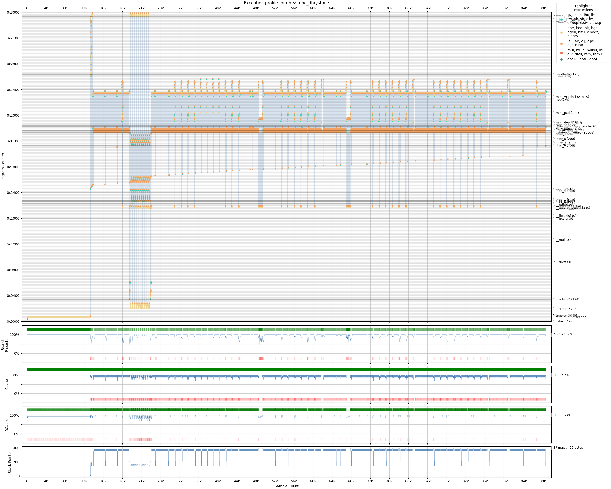
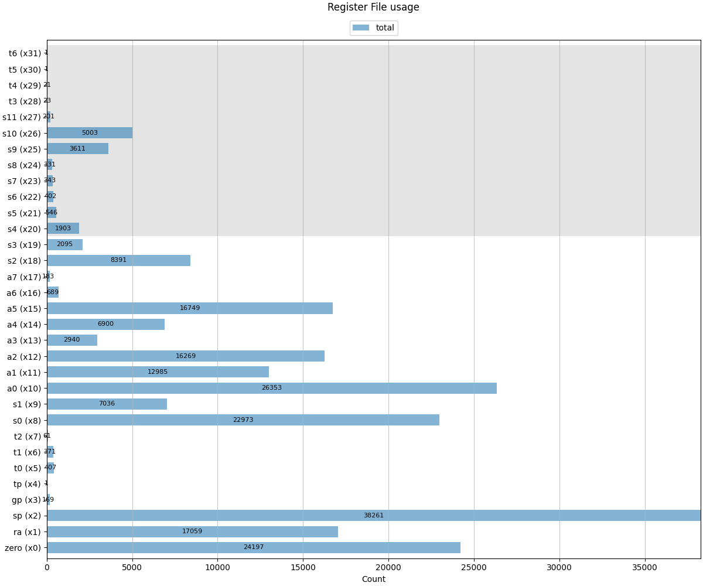

# RISC-V ISA simulator

C++ Instruction Set Simulator for RISC-V RV32IMC & custom SIMD instructions with cache and branch predictor models, C/ASM workloads, and Python analysis tools

- [RISC-V ISA simulator](#risc-v-isa-simulator)
- [Getting the project](#getting-the-project)
  - [Quick start](#quick-start)
- [Overview](#overview)
  - [Usage](#usage)
- [Example use-case: Dhrystone](#example-use-case-dhrystone)
  - [Running Dhrystone](#running-dhrystone)
    - [Notes on profiling](#notes-on-profiling)
  - [Execution log](#execution-log)
  - [Callstack](#callstack)
  - [Profiled instructions](#profiled-instructions)
  - [Execution trace and register file usage](#execution-trace-and-register-file-usage)
  - [Hardware models outputs](#hardware-models-outputs)
  - [Analysis scripts](#analysis-scripts)
    - [Flat profile](#flat-profile)
    - [FlameGraph](#flamegraph)
    - [Call Graph](#call-graph)
    - [Execution visualization](#execution-visualization)
    - [Hardware performance estimates](#hardware-performance-estimates)
- [Hardware model sweeps](#hardware-model-sweeps)
  - [Caches](#caches)
  - [Branch predictors](#branch-predictors)
- [Building RISC-V programs](#building-risc-v-programs)
  - [Baremetal](#baremetal)
    - [Benchmarks](#benchmarks)
    - [Quantized Neural Network](#quantized-neural-network)
  - [RISC-V ISA tests](#risc-v-isa-tests)
- [Gtest](#gtest)
- [Building the Simulator](#building-the-simulator)
- [Custom SIMD ISA](#custom-simd-isa)


# Getting the project
Project relies on a few external libraries and tools. Clone recursively with
```sh
git clone --recurse-submodules git@github.com:AleksandarLilic/ama-riscv-sim.git
```

## Quick start
To check that everything is available and working as expected:
1. build a single test
2. build the simulator
3. run the test and check the logs

``` sh
# build test
cd sw/baremetal/dhrystone
make DHRY_ITERS=10 # override number of iterations for testing only
cd -
# build ISA sim
cd src
make -j
# run test, profile from the beginning, log executed instructions
./ama-riscv-sim ../sw/baremetal/dhrystone/dhrystone.elf --prof_pc_start 10000 -l
# check the execution log
vim out_dhrystone_dhrystone/exec.log
```

Simulator `stdout`
```
Running: ../sw/baremetal/dhrystone/dhrystone.elf
Profiling start PC: 0x10000
Logging enabled

=== UART START ===
...
=== UART END ===

Instruction Counters: executed: 108881, logged: 108881
    0x051e tohost    : 0x00000001
Profiler Fusion: LEA opportunities: 10
Profiler Perf: Event: exec, Samples: 108881
Profiler: Inst: 108881 - 32/16-bit: 108881/0(100.00%/0.00%)
    Control: B: 15771(14.48%), J: 10736(9.86%), NOP: 0(0.00%)
    Memory: MEM: 34368(31.56%) - L/S: 16573/17795(15.22%/16.34%)
    Compute:  A&L: 47988(44.07%), MUL: 10(0.01%), DIV: 0(0.00%)
    Bitmanip: Zbb: 0(0.00%)
    SIMD: A&L: 0(0.00%), MUL: 0(0.00%), DOT: 0(0.00%), UNPK: 0(0.00%)
    Hints: SCP: 0(0.00%)
    Rest: 8(0.01%)
Profiler Sparsity: total: 0, sparse: 0(0.00%)
Profiler Stack: peak usage: 0 B, Accesses: 25927(75.44%) - L/S: 12712/13215(36.99%/38.45%)
Branch stats: unique branches: 110
bpred (active: combined)
    combined       (   58 B): P: 15245, M: 526, ACC: 96.66%
icache (W/S: 4/1, D/T/M: 256/6/3 B): R: 109844, H: 104858, M: 4986, E: 4982, WB: 0, HR: 95.46%; CT (R/W): core 429.1/0.0 KB, mem 311.6/0.0 KB
    s0:  w0 [23265]  w1 [38571]  w2 [24295]  w3 [23713]
dcache (W/S: 8/1, D/T/M: 512/12/7 B): R: 31032, H: 30642, M: 390, E: 382, WB: 268, HR: 98.74%; CT (R/W): core 48/58 KB, mem 24/17 KB
    s0:  w0 [ 3759]  w1 [20684]  w2 [  932]  w3 [  844]  w4 [  974]  w5 [ 1296]  w6 [ 1206]  w7 [ 1337]
```

Outputs:
``` sh
ls out_dhrystone_dhrystone
callstack_folded_exec.txt  exec.log  hw_stats.json  inst_profiler.json
```

# Overview

Some simulator options depend on the build switches. This doc assumes default build switches which is the standalone mode with all available features included

Core functionalities:
1. Standalone ISA simulator capable of running applications targeting [RV32IMC_zicsr_zifencei_zicntr](https://rv.drom.io/?RV32IMC_zicsr_zifencei_zicntr) + custom SIMD ISA
2. API for single step execution, aimed at DPI verification environments

Profilers:
1. Records the folded callstack based on the user-specified event source (`callstack_folded_exec.txt`)
2. Records breakdown of executed instruction (`inst_profiler.json`)
3. Provides stack usage stats (`inst_profiler.json` and `stdout`)
4. Records execution trace (`trace.bin`)
5. Records register file usage (`rf_usage.bin`)
6. Provides sparsity check for the custom SIMD extension (`stdout`)
7. Can be run in the timed environment (e.g. DPI) and use its time source for instruction cycles and callstack profiler source

Logging:
1. Records each executed instruction, the current callstack, and registers & memory locations changed by the instruction (`exec.log`)
2. Optionally records entire architectural state after each executed instruction
3. Optionally records the entire execution (from reset to the end of simulation), instead of just the profiling range

Hardware models:
1. Provides L1I and L1D caches as both statistical (metadata only) or functional (with data storage) models.
    1. number of sets - parametrizable from the CLI
    2. number of ways - parametrizable from the CLI
    3. replacement policy - only LRU is available
2. Records separate cache stats for the user defined region of interest (ROI)
3. Provides various branch predictor models
    1. The user specified one is completely configurable from the CLI
    2. The rest are hardcoded (provides variety), and can optionally be run (in parallel)
    3. Any number of branch predictors can be run in parallel, but only the user specified one will drive the L1I cache - the 'active' predictor
4. Provides branch stats for the number of unique branches (`stdout`) and performance of each of the predictors for the given unique branch (`branches.csv`)
5. Records runtime hardware statistics in the same region as the profilers (`hw_stats.json` and `stdout`)

Analysis scripts:
1. FlameGraphs
2. Detailed execution visualization
3. Performance estimates
4. Hardware models parameters sweep

Emulator is used through DPI for verification of the SystemVerilog implementation: [ama-riscv](https://github.com/AleksandarLilic/ama-riscv)

## Usage
The only required user argument is a path to the RISC-V executable, every other argument can use its default value

```
./ama-riscv-sim -h
ama-riscv-sim
Usage:
  ./ama-riscv-sim [OPTION...] <path_to_elf_file>

      --rf_names arg            Register file names used for output. Options: x, abi (default: abi)
      --end_dump_state          Dump all registers at the end of simulation
      --out_dir_tag arg         Tag (suffix) for output directory (default: "")
      --prof_pc_start arg       Start PC (hex) for profiling (default: 0)
      --prof_pc_stop arg        Stop PC (hex) for profiling (default: 0)
      --prof_pc_single_match arg
                                Run profiling only for match number (0 for all matches) (default: 0)
      --prof_trace              Enable profiler trace
  -e, --perf_event arg          Performance event to track. Options: bp_mispredict, dcache_reference, dcache_miss,
                                icache_reference, icache_miss, simd, mem, branches, inst (default: inst)
      --rf_usage                Enable profiling register file usage
  -l, --log                     Enable logging
      --log_always              Always log execution. Otherwise, log during profiling only
      --log_state               Log state after each executed instruction
      --icache_sets arg         Number of sets in I$ (default: 1)
      --icache_ways arg         Number of ways in I$ (default: 4)
      --icache_policy arg       I$ replacement policy.
                                Options: lru (default: lru)
      --dcache_sets arg         Number of sets in D$ (default: 1)
      --dcache_ways arg         Number of ways in D$ (default: 8)
      --dcache_policy arg       D$ replacement policy.
                                Options: lru (default: lru)
      --roi_start arg           D$ Region of interest start address (hex) (default: 0)
      --roi_size arg            D$ Region of interest size (default: 0)
      --bp_active arg           Active branch predictor (driving I$).
                                Options: none, gselect, ideal, global, gshare, local, combined, bimodal, static
                                  (default: combined)
      --bp_combined_p1 arg      First branch predictor for combined predictor. Counters will be weakly biased
                                towards this predictor (impacts warm-up period)
                                Options: gselect, ideal, global, gshare, local, bimodal, static
                                  (default: static)
      --bp_combined_p2 arg      Second branch predictor for combined predictor.
                                Options: gselect, ideal, global, gshare, local, bimodal, static
                                  (default: gselect)
      --bp_run_all              Run all branch predictors
      --bp_dump_csv             Dump branch predictor stats to CSV
      --bp_static_method arg    Static predictor - method.
                                Options: btfn, ant, at (default: btfn)
      --bp_bimodal_pc_bits arg  Bimodal predictor - PC bits (default: 7)
      --bp_bimodal_cnt_bits arg
                                Bimodal predictor - counter bits (default: 3)
      --bp_local_pc_bits arg    Local predictor - PC bits (default: 5)
      --bp_local_cnt_bits arg   Local predictor - counter bits (default: 3)
      --bp_local_hist_bits arg  Local predictor - local history bits (default: 5)
      --bp_global_cnt_bits arg  Global predictor - counter bits (default: 3)
      --bp_global_gr_bits arg   Global predictor - global register bits (default: 7)
      --bp_gselect_cnt_bits arg
                                Gselect predictor - counter bits (default: 1)
      --bp_gselect_gr_bits arg  Gselect predictor - global register bits (default: 6)
      --bp_gselect_pc_bits arg  Gselect predictor - PC bits (default: 2)
      --bp_gshare_cnt_bits arg  Gshare predictor - counter bits (default: 1)
      --bp_gshare_gr_bits arg   Gshare predictor - global register bits (default: 8)
      --bp_gshare_pc_bits arg   Gshare predictor - PC bits (default: 8)
      --bp_combined_pc_bits arg
                                Combined predictor - PC bits (default: 6)
      --bp_combined_cnt_bits arg
                                Combined predictor - counter bits (default: 3)
  -h, --help                    Print usage
```

# Example use-case: Dhrystone
Example use-case which includes all generated log files from the simulator and the applicable analysis outputs is available under [examples/out_dhrystone_dhrystone](./examples/out_dhrystone_dhrystone). The `stdout` redirected to a file is also available

The following paragraphs will go into detail about each of the logs, analysis, and visualization

ISA sim and Dhrystone are assumed to have been built as described in the [Quick start](#quick-start)

## Running Dhrystone
To generate all available outputs, run
```sh
./ama-riscv-sim ../sw/baremetal/dhrystone/dhrystone.elf --prof_pc_start 10000 --prof_trace --rf_usage --bp_dump_csv -l
```

Outputs:
``` sh
ls out_dhrystone_dhrystone
branches.csv  callstack_folded_exec.txt  exec.log  hw_stats.json  inst_profiler.json  rf_usage.bin  trace.bin
```
### Notes on profiling
A more common way of profiling is to only focus on one part of the workload at the time. In case of Dhrystone, the following will profile only a single loop, 8th time it is encountered

``` sh
./ama-riscv-sim ../sw/baremetal/dhrystone/dhrystone.elf --prof_pc_start 115a0 --prof_pc_stop 11674 --prof_pc_single_match 8
```

Cache and branch predictor models are still running while profiling is inactive, but don't record any stats

Another useful option when analyzing cache behavior is to profile a specific memory region. For example, `mlp` benefits from having high hit rate for the input image in the first layer, and its hit rate can be analyzed with

```sh
./ama-riscv-sim ../sw/baremetal/mlp/w8a8.elf --roi_start 0x00017900 --roi_size 256
```
After the simulations finishes, the `stdout` has one more line with ROI stats:
```
...
ROI: (0x17900 - 0x17a00): R: 4100, H: 4096, M: 4, E: 4, WB: 0, HR: 99.90%; CT (R/W): core 16.0/0.0 KB, mem 256.0/0.0 B
...
```

Memory location of the image might always be at this address. Search the `*.dump` for `input_img_0` symbol start.

Perf events can also be changed, which can help when analyzing e.g. tricky branch prediction section (`--perf_event bp_mispredict`), or heavy traffic and cache misses (`--perf_event dcache_miss`). Complete list of events is listed in the [Usage](#usage) chapter.

## Execution log
Execution log, saved as `exec.log`, logs instructions as they are executed. Compact version (default options) is saved and it  includes:
- the current callstack
- instruction count during profiling (omitted when profiling is inactive)
- PC
- Instruction and its disassembly
- modified register(s), memory locations, CSRs (instruction dependent)


Snippets taken from the [examples/out_dhrystone_dhrystone/exec.log](./examples/out_dhrystone_dhrystone/exec.log)
```
_start;
         1: 10000: 00000093 addi ra,zero,0            ra  : 0x00000000
         2: 10004: 00000113 addi sp,zero,0            sp  : 0x00000000
         3: 10008: 00000193 addi gp,zero,0            gp  : 0x00000000
...
        33: 10080: 06028293 addi t0,t0,96             t0  : 0x000100dc
        34: 10084: 30529073 csrrw zero,mtvec,t0       0x0305 mtvec     : 0x000100dc
        35: 10088: 00005197 auipc gp, 0x5             gp  : 0x00015088
...
clear_bss_w;
        43: 100a8: 00450613 addi a2,a0,4              a2  : 0x00014188
        44: 100ac: 00c5e863 bltu a1,a2,100bc
        45: 100b0: 00052023 sw zero,0(a0)             mem[14184] <- zero (0x00000000)
        46: 100b4: 00450513 addi a0,a0,4              a0  : 0x00014188
        47: 100b8: fe0008e3 beq zero,zero,100a8
...
call_main;
     13337: 100d0: 3b0010ef jal ra,11480              ra  : 0x000100d4
call_main;main;
     13338: 11480: f7010113 addi sp,sp,-144           sp  : 0x0001ff70
     13339: 11484: 03000513 addi a0,zero,48           a0  : 0x00000030
     13340: 11488: 08112623 sw ra,140(sp)             mem[1fffc] <- ra (0x000100d4)
     13341: 1148c: 07512a23 sw s5,116(sp)             mem[1ffe4] <- s5 (0x00000000)
     13342: 11490: 07a12023 sw s10,96(sp)             mem[1ffd0] <- s10 (0x00000000)
     13343: 11494: 05b12e23 sw s11,92(sp)             mem[1ffcc] <- s11 (0x00000000)
     13344: 11498: 08812423 sw s0,136(sp)             mem[1fff8] <- s0 (0x00000000)
     13345: 1149c: 08912223 sw s1,132(sp)             mem[1fff4] <- s1 (0x00000000)
     13346: 114a0: 09212023 sw s2,128(sp)             mem[1fff0] <- s2 (0x00000000)
     13347: 114a4: 07312e23 sw s3,124(sp)             mem[1ffec] <- s3 (0x00000000)
     13348: 114a8: 07412c23 sw s4,120(sp)             mem[1ffe8] <- s4 (0x00000000)
     13349: 114ac: 07612823 sw s6,112(sp)             mem[1ffe0] <- s6 (0x00000000)
     13350: 114b0: 07712623 sw s7,108(sp)             mem[1ffdc] <- s7 (0x00000000)
     13351: 114b4: 07812423 sw s8,104(sp)             mem[1ffd8] <- s8 (0x00000000)
     13352: 114b8: 07912223 sw s9,100(sp)             mem[1ffd4] <- s9 (0x00000000)
     13353: 114bc: 198010ef jal ra,12654              ra  : 0x000114c0
call_main;main;malloc;
     13354: 12654: 00050593 addi a1,a0,0              a1  : 0x00000030
     13355: 12658: 8101a503 lw a0,-2032(gp)           a0  : 0x00014050 <- mem[14180]
     13356: 1265c: 0040006f jal zero,12660
...
```

A detailed version can be generated by adding `--log_state`. This will include the entire architectural state after each executed instruction, and all CSRs when any one is modified. It's indented such that it can be completely folded inside the code editor. When folded, it's as compact as the version without state log

```
_start;
         1: 10000: 00000093 addi ra,zero,0            ra  : 0x00000000
            PC: 10000
            zero: 0x00000000   ra  : 0x00000000   sp  : 0x00c0ffee   gp  : 0x00c0ffee
            tp  : 0x00c0ffee   t0  : 0x00c0ffee   t1  : 0x00c0ffee   t2  : 0x00c0ffee
            s0  : 0x00c0ffee   s1  : 0x00c0ffee   a0  : 0x00c0ffee   a1  : 0x00c0ffee
            a2  : 0x00c0ffee   a3  : 0x00c0ffee   a4  : 0x00c0ffee   a5  : 0x00c0ffee
            a6  : 0x00c0ffee   a7  : 0x00c0ffee   s2  : 0x00c0ffee   s3  : 0x00c0ffee
            s4  : 0x00c0ffee   s5  : 0x00c0ffee   s6  : 0x00c0ffee   s7  : 0x00c0ffee
            s8  : 0x00c0ffee   s9  : 0x00c0ffee   s10 : 0x00c0ffee   s11 : 0x00c0ffee
            t3  : 0x00c0ffee   t4  : 0x00c0ffee   t5  : 0x00c0ffee   t6  : 0x00c0ffee
...
```

## Callstack
Folded callstack is saved as `callstack_folded_exec.txt` and is ready to be used with [script/FlameGraph/flamegraph.pl](./script/FlameGraph/flamegraph.pl). If other perf events are used, the output will be saved under the appropriate name, e.g. `callstack_folded_bp_mispredict.txt`

Example snippet from the folded callstack
```
...
call_main;main;Func_1; 100
call_main;main;Proc_1;Proc_6;Func_3; 30
call_main;main;Proc_1;Proc_7; 40
call_main;main;Proc_1; 570
call_main;main;Proc_8; 250
call_main;main;Proc_7; 80
call_main;main;Func_2;Func_1; 50
call_main;main;Proc_4; 100
call_main;main;Proc_5; 40
call_main;main;Proc_1;Proc_6; 200
call_main;main;Func_2;strcmp; 570
...
```

## Profiled instructions
Profiled instructions summary is saved as `inst_profiler.json`. Execution of each supported instruction is counted. Control flow instructions are further broken down based on the direction, and if taken or not. Finally, stack usage is logged together with number of profiled instructions

``` json
{
"add": {"count": 3718},
"sub": {"count": 269},
"sll": {"count": 8},
...
"beq": {"count": 6496, "breakdown": {"taken": 2813, "taken_fwd": 85, "taken_bwd": 2728, "not_taken": 3683, "not_taken_fwd": 1944, "not_taken_bwd": 1739}},
"bne": {"count": 3906, "breakdown": {"taken": 1897, "taken_fwd": 0, "taken_bwd": 1897, "not_taken": 2009, "not_taken_fwd": 255, "not_taken_bwd": 1754}},
...
"_max_sp_usage": 400,
"_profiled_instructions": 108881
}
```

## Execution trace and register file usage
Execution trace, saved as `trace.bin`, contains `trace_entry` struct for each executed instruction, and it's needed as an input for the analysis scripts (below)

Similarly, register file usage is saved as `rf_usage.bin`. As each instruction is executed, appropriate counters are incremented based on the used register(s), and the type of usage (destination, source 1, or source 2)

## Hardware models outputs
Stats for three hardware models are available as `hw_stats.json`
```json
{
"icache": {"references": 109844, "hits": 104858, "misses": 4986, "evicts": 4982, "writebacks": 0, "ct_core": {"reads": 439376, "writes": 0}, "ct_mem": {"reads": 319104, "writes": 0}, "size": {"data": 256, "tags": 6, "metadata": 3, "sets": 1, "ways": 4, "line_size": 64}},
"dcache": {"references": 31032, "hits": 30642, "misses": 390, "evicts": 382, "writebacks": 268, "ct_core": {"reads": 48781, "writes": 58961}, "ct_mem": {"reads": 24960, "writes": 17152}, "size": {"data": 512, "tags": 12, "metadata": 7, "sets": 1, "ways": 8, "line_size": 64}},
"bpred": {"type": "combined", "branches": 15771, "predicted": 15245, "predicted_fwd": 7120, "predicted_bwd": 8125, "mispredicted": 526, "mispredicted_fwd": 283, "mispredicted_bwd": 243, "size": 58},"_done": true
}
```

Additionally, detailed breakdowns of all branches and predictor stats for each are available in `branches.csv`

```csv
PC,Direction,Funct3,Funct3_mn,Taken,Not_Taken,All,Taken%,P_combined,P_combined%,Best,P_best,P_best%,Pattern
100ac,F,6,bltu,1,2654,2655,0.0,2654,100.0,combined,2654,100.0,2654N 1T
100b8,B,0,beq,2654,0,2654,100.0,2654,100.0,combined,2654,100.0,2654T
100bc,F,7,bgeu,1,0,1,100.0,0,0.0,combined,0,0.0,1T
101fc,F,1,bne,0,10,10,0.0,10,100.0,combined,10,100.0,10N
10220,F,1,bne,0,10,10,0.0,10,100.0,combined,10,100.0,10N
...
111ac,F,0,beq,0,112,112,0.0,110,98.2,combined,110,98.2,112N
111b4,F,7,bgeu,72,40,112,64.3,75,67.0,combined,75,67.0,8T 10N 16T 2N 2T 8N 10T 2N 2T 2N 2T 8N 10T 2N 2T 2N 6T 2N 2T 2N 12T
111b8,F,5,bge,0,164,164,0.0,164,100.0,combined,164,100.0,164N
...
```

## Analysis scripts
Collection of custom and open source tools are provided for profiling, analysis, and visualization

### Flat profile
Similar to the GNU Profiler `gprof`, flat profile script provides samples/time spent in all executed functions, and prints it to the `stdout`

```sh
./script/prof_stats.py examples/out_dhrystone_dhrystone/callstack_folded_exec.txt
```

Output (also available under [examples/out_dhrystone_dhrystone/prof_stats_exec.txt](examples/out_dhrystone_dhrystone/prof_stats_exec.txt)):  
```
     % cumulative       self      total   name
 28.70      28.70      31248      41256   _write
 19.72      48.42      21475      89017   mini_vpprintf
 18.34      66.76      19968      61224   __puts_uart
 12.19      78.95      13272      13272   clear_bss_w
  9.19      88.14      10008      10008   send_byte_uart0
  2.61      90.76       2844       2844   __udivsi3
  2.14      92.89       2325       5041   mini_itoa
  1.10      93.99       1200      90217   mini_printf
  0.95      94.94       1032       1032   strcpy
  0.86      95.80        931      95544   main
  0.71      96.51        777        777   mini_pad
  0.52      97.03        570        940   Proc_1
  0.52      97.56        570        570   strcmp
  0.46      98.02        500        500   mini_strlen
  0.26      98.27        280        900   Func_2
  0.23      98.50        250        250   Proc_8
  0.19      98.69        204       1516   __umodsi3
  0.18      98.87        200        230   Proc_6
  0.18      99.05        198        250   _malloc_r
  0.18      99.23        194        338   __udivdi3
  0.14      99.37        150        150   Func_1
  0.11      99.48        120        120   Proc_7
  0.09      99.57        100        100   Proc_3
  0.09      99.66        100        100   Proc_4
  0.08      99.75         90         90   Proc_2
  0.04      99.79         42         42   _start
  0.04      99.82         40         40   Proc_5
  0.03      99.85         32         32   __mulsi3
  0.03      99.88         30         30   Func_3
  0.03      99.91         30         48   _sbrk_r
  0.02      99.93         20         20   __divsi3
  0.02      99.94         20         20   __libc_init_array
  0.02      99.96         20        368   time_s
  0.02      99.98         18         18   _sbrk
  0.01      99.99         10         10   get_cpu_time
  0.01      99.99          6          6   malloc
  0.00     100.00          2          2   __malloc_lock
  0.00     100.00          2          2   __malloc_unlock
  0.00     100.00          1      95545   call_main
  0.00     100.00          1          1   clear_bss_b
  0.00     100.00          1         21   done_bss
```

The 10 iterations Dhrystone run is useful as an example run since the values are small and runtime very short. For the very same reasons, it's not useful as an actual benchmark, and it also skews the results since the `printf` takes longer than benchmark itself. 

Therefore, the 80k iterations version is also available as an example under [examples/out_dhrystone_dhrystone_80k](./examples/out_dhrystone_dhrystone_80k)

`stdout` of 80k version with `--top 20` argument
```
     % cumulative       self      total   name
 20.22      20.22    6880172    6880172   strcpy
 15.05      35.27    5120331   34016085   main
 13.40      48.67    4560000    7520000   Proc_1
 13.40      62.07    4560000    4560000   strcmp
  6.58      68.65    2240000    7200000   Func_2
  5.88      74.53    2000000    2000000   Proc_8
  5.19      79.71    1765316    1765316   __udivsi3
  4.70      84.41    1600000    1840000   Proc_6
  3.53      87.94    1200000    1200000   Func_1
  2.82      90.76     960000     960000   Proc_7
  2.35      93.11     800000     800000   Proc_3
  2.35      95.46     800000     800000   Proc_4
  2.12      97.58     720000     720000   Proc_2
  0.94      98.52     320000     320000   Proc_5
  0.71      99.23     240000     240000   Func_3
  0.47      99.70     160000     160000   __divsi3
  0.09      99.79      31432      41548   _write
  0.06      99.85      21685      91915   mini_vpprintf
  0.06      99.91      20059      61607   __puts_uart
  0.04      99.95      13272      13272   clear_bss_w
```

### FlameGraph
A lightweight wrapper is provided for chart formatting and annotation around the open source [FlameGraph scripts](https://github.com/brendangregg/FlameGraph)
``` sh
./script/get_flamegraph.py examples/out_dhrystone_dhrystone/callstack_folded_exec.txt
```
Open the generated interactive `flamegraph_exec.svg` in the web browser

Dhrystone example with 10 iterations:  


Dhrystone example with 80k iterations:  


### Call Graph  
Similarly, a lightweight wrapper around the open source [gprof2dot tool](https://github.com/jrfonseca/gprof2dot) is provided for generating Call Graphs from the same folded callstack 

Generate DOT and PNG with
```
./script/get_call_graph.py examples/out_dhrystone_dhrystone/callstack_folded_exec.txt --png
```

Wrapper additionally provides a few other options for saving the output call graph, other than the mandatory `.dot` format
```
usage: get_call_graph.py [-h] [--svg] [--png] [--pdf] input

Convert collapsed callstack to call graph

positional arguments:
  input       Collapsed stack trace

options:
  -h, --help  show this help message and exit
  --svg       Also save output as SVG
  --png       Also save output as PNG
  --pdf       Also save output as PDF
```

The `.dot` format can be opened directly with
```
xdot callstack_folded_exec.dot
```

Dhrystone example with 10 iterations:  


Dhrystone example with 80k iterations:  


### Execution visualization

Main analysis script
```
./script/run_analysis.py -h
usage: run_analysis.py [-h] [-i INST_LOG] [-t TRACE] [--exclude EXCLUDE [EXCLUDE ...]] [--exclude_type EXCLUDE_TYPE [EXCLUDE_TYPE ...]]
                       [--top TOP] [--allow_zero] [--dasm DASM] [--no_pc_limit] [--pc_begin PC_BEGIN] [--pc_end PC_END] [--pc_only]
                       [--no_dmem_limit] [--dmem_begin DMEM_BEGIN] [--dmem_end DMEM_END] [--dmem_only] [--symbols_only] [--save_symbols]
                       [--time_series_limit TIME_SERIES_LIMIT] [--save_converted_bin] [--highlight HIGHLIGHT [HIGHLIGHT ...]] [-s]
                       [--save_png] [--save_svg] [--save_csv]

Analysis of memory access logs and traces

options:
  -h, --help            show this help message and exit
  -i INST_LOG, --inst_log INST_LOG
                        Path to JSON instruction count log with profiling data
  -t TRACE, --trace TRACE
                        Path to binary execution trace
  --exclude EXCLUDE [EXCLUDE ...]
                        Exclude specific instructions. Instruction count log only option
  --exclude_type EXCLUDE_TYPE [EXCLUDE_TYPE ...]
                        Exclude specific instruction types. Available types are: ARITH, BITMANIP, UNPAK, MEM, MEM_HINTS, BRANCH, JUMP, CSR,
                        ENV, NOP, FENCE. Instruction count log only option
  --top TOP             Number of N most common instructions to display. Default is all. Instruction count log only option
  --allow_zero          Allow instructions with zero count to be displayed. Instruction count log only option
  --dasm DASM           Path to disassembly 'dasm' file to backannotate the trace. This file and the new annotated file is saved in the
                        same directory as the input trace with *.prof.<original ext> suffix. Trace only option
  --no_pc_limit         Don't limit the PC range to the execution trace. Useful when logging is done with HINT instruction. By default, the
                        PC range is limited to the execution trace range. Trace only option
  --pc_begin PC_BEGIN   Show only PCs after this PC. Input is a hex string. E.g. '0x80000094'. Applied after --no_pc_limit. Trace only
                        option
  --pc_end PC_END       Show only PCs before this PC. Input is a hex string. E.g. '0x800000ec'. Applied after --no_pc_limit. Trace only
                        option
  --pc_only             Only backannotate and display the PC trace. Trace only option
  --no_dmem_limit       Don't limit the DMEM range to the execution trace. Same as --no_pc_limit but for DMEM. Trace only option
  --dmem_begin DMEM_BEGIN
                        Show only DMEM addresses after this address. Input is a hex string. E.g. '0x80000200'. Applied after
                        --no_dmem_limit. Trace only option
  --dmem_end DMEM_END   Show only DMEM addresses before this address. Input is a hex string. E.g. '0x800002f0'. Applied after
                        --no_dmem_limit. Trace only option
  --dmem_only           Only backannotate and display the DMEM trace. Trace only option
  --symbols_only        Only backannotate and display the symbols found in the 'dasm' file. Requires --dasm. Doesn't display figures and
                        ignores all save options except --save_csv. Trace only option
  --save_symbols        Save the symbols found in the 'dasm' file as a JSON file. Requires --dasm. Trace only option
  --time_series_limit TIME_SERIES_LIMIT
                        Limit the number of address entries to display in the time series chart. Default is 50000. Trace only option
  --save_converted_bin  Save the converted binary trace as a CSV file. Trace only option
  --highlight HIGHLIGHT [HIGHLIGHT ...], --hl HIGHLIGHT [HIGHLIGHT ...]
                        Highlight specific instructions. Multiple instructions can be provided as a single string separated by whitespace
                        (multiple groups) or separated by commas (multiple instructions in a group). E.g.: 'add,addi sub' colors 'add' and
                        'addi' the same and 'sub' a different color.
  -s, --silent          Don't display chart(s) in pop-up window
  --save_png            Save charts as PNG
  --save_svg            Save charts as SVG
  --save_csv            Save source data formatted as CSV
```

Register file usage
```
./script/plot_rf_usage.py -h
usage: plot_rf_usage.py [-h] [--save_png] [--save_svg] [--save_csv] log

Plot register file usage

positional arguments:
  log         Input binary log from profiler

options:
  -h, --help  show this help message and exit
  --save_png  Save charts as PNG
  --save_svg  Save charts as SVG
  --save_csv  Save source data formatted as CSV
```

Run execution profile analysis and highlight listed instructions
```sh
HL="lw,lh,lb,lhu,lbu,sw,sh,sb bne,beq,blt,bge,bgeu,bltu jal,jalr"
./script/run_analysis.py -i examples/out_dhrystone_dhrystone/inst_profiler.json --highlight $HL
```

Run trace analysis with annotated symbols and highlight
```sh
./script/run_analysis.py -t examples/out_dhrystone_dhrystone/trace.bin --dasm sw/baremetal/dhrystone/dhrystone.dump --highlight $HL --time_series_limit 200000 --save_symbols --save_converted_bin
```
For long traces, as in the example above, the limit is increased with `--pc_time_series_limit 200000`  
Optionally, save symbols found in `dasm` for later annotation with `--save_symbols` as `symbols.json`  
Part of the code/program can be filtered out by specifying program counter begin/end with: `--pc_begin 0x11480 --pc_end 0x11b3c`  
Part of the execution can be filtered out by specifying sample count begin/end with: `--sample_begin 20000 --sample_end 30000`  

Generate register file usage plots and save csv
```sh
./script/plot_rf_usage.py -t examples/out_dhrystone_dhrystone/rf_usage.bin --save_csv
```

***Execution profile***


***Execution trace visualization***





***Register file usage***



***Backannotation of disassembly***

At runtime, main analysis script outputs all symbols and the number of executed instruction in each to `stdout`
```
Symbols found in ../sw/baremetal/dhrystone/dhrystone.dump in 'text' section:
0x3144 - 0x3430: _free_r (0)
0x3004 - 0x3140: _malloc_trim_r (0)
0x2F60 - 0x3000: strcpy (1032)
0x2ED4 - 0x2F5C: __libc_init_array (20)
0x2E78 - 0x2ED0: _sbrk_r (30)
0x2E74 - 0x2E74: __malloc_unlock (2)
0x2E70 - 0x2E70: __malloc_lock (2)
0x2660 - 0x2E6C: _malloc_r (198)
0x2654 - 0x265C: malloc (6)
0x2618 - 0x2650: _sbrk (18)
0x22DC - 0x2614: mini_vpprintf (21475)
0x2268 - 0x22D8: _puts (0)
0x205C - 0x2264: mini_pad (777)
0x1EF4 - 0x2058: mini_itoa (2325)
0x1ECC - 0x1EF0: mini_strlen (500)
0x1E70 - 0x1EC8: trap_handler (0)
0x1E44 - 0x1E6C: timer_interrupt_handler (0)
0x1E30 - 0x1E40: get_cpu_time (10)
0x1DE0 - 0x1E2C: mini_printf (1200)
0x1DAC - 0x1DDC: __puts_uart (19968)
0x1D5C - 0x1DA8: _write (31248)
0x1D44 - 0x1D58: send_byte_uart0 (10008)
0x1D1C - 0x1D40: time_s (20)
0x1C5C - 0x1D18: Proc_6 (200)
0x1C50 - 0x1C58: Func_3 (30)
0x1BD4 - 0x1C4C: Func_2 (280)
0x1BB4 - 0x1BD0: Func_1 (150)
0x1B50 - 0x1BB0: Proc_8 (250)
0x1B40 - 0x1B4C: Proc_7 (120)
0x1480 - 0x1B3C: main (931)
0x1470 - 0x147C: Proc_5 (40)
0x1448 - 0x146C: Proc_4 (100)
0x12E8 - 0x1444: Proc_1 (570)
0x12C0 - 0x12E4: Proc_3 (100)
0x1298 - 0x12BC: Proc_2 (90)
0x124C - 0x1294: __clzsi2 (0)
0x121C - 0x1248: __modsi3 (0)
0x11E8 - 0x1218: __umodsi3 (204)
0x11A0 - 0x11E4: __udivsi3 (2844)
0x11A0 - 0x11A0: __hidden___udivsi3 (0)
0x1198 - 0x119C: __divsi3 (20)
0x1174 - 0x1194: __mulsi3 (32)
0x1064 - 0x1170: __floatsisf (0)
0x0FF4 - 0x1060: __fixsfsi (0)
0x0CA8 - 0x0FF0: __mulsf3 (0)
0x0934 - 0x0CA4: __divsf3 (0)
0x036C - 0x0930: __udivdi3 (194)
0x01F0 - 0x0368: strcmp (570)
0x00DC - 0x01EC: trap_entry (0)
0x00D8 - 0x00D8: forever (0)
0x00D0 - 0x00D4: call_main (1)
0x00CC - 0x00CC: done_bss (1)
0x00BC - 0x00C8: clear_bss_b (1)
0x00A8 - 0x00B8: clear_bss_w (13272)
0x0000 - 0x00A4: _start (42)
Symbols found in ../sw/baremetal/dhrystone/dhrystone.dump in 'data' section:
0x4180 - 0x4182: _impure_ptr
0x417C - 0x417E: __malloc_trim_threshold
0x4178 - 0x417A: __malloc_sbrk_base
0x4170 - 0x4176: __SDATA_BEGIN__
0x4050 - 0x40FC: _impure_data
0x3C48 - 0x404E: __DATA_BEGIN__
0x3C48 - 0x3C48: __malloc_av_
0x3434 - 0x3C42: __clz_tab-0x3c
```

It also backannotates the disassembly and saves it as `*.prof.dasm`
```
00010000 <_start>:
    1    10000:	00000093          	addi	x1,x0,0
    1    10004:	00000113          	addi	x2,x0,0
    1    10008:	00000193          	addi	x3,x0,0
    1    1000c:	00000213          	addi	x4,x0,0
    1    10010:	00000293          	addi	x5,x0,0
    1    10014:	00000313          	addi	x6,x0,0
...
000100a8 <clear_bss_w>:
 2655    100a8:	00450613          	addi	x12,x10,4
 2655    100ac:	00c5e863          	bltu	x11,x12,100bc <clear_bss_b>
 2654    100b0:	00052023          	sw	x0,0(x10)
 2654    100b4:	00450513          	addi	x10,x10,4
 2654    100b8:	fe0008e3          	beq	x0,x0,100a8 <clear_bss_w>
...
00011470 <Proc_5>:
   10    11470:	04100793          	addi	x15,x0,65
   10    11474:	8201a823          	sw	x0,-2000(x3) # 141a0 <Bool_Glob>
   10    11478:	82f186a3          	sb	x15,-2003(x3) # 1419d <Ch_1_Glob>
   10    1147c:	00008067          	jalr	x0,0(x1)
...
```

### Hardware performance estimates

Hardware performance estimates are done based on three inputs:
1. instruction profiler output, e.g. [examples/out_dhrystone_dhrystone/inst_profiler.json](examples/out_dhrystone_dhrystone/inst_profiler.json)
2. program specific hardware stats output, e.g. [examples/out_dhrystone_dhrystone/hw_stats.json](examples/out_dhrystone_dhrystone/hw_stats.json)
3. microarchitecture specific config, e.g. [script/hw_perf_metrics_v2.json](script/hw_perf_metrics_v2.json)

Microarchitecture description is based on the [ama-riscv](https://github.com/AleksandarLilic/ama-riscv) implementation

Entires other than `*_mhz` and `*_name` specify the number of cycles/stages it takes for instruction or hardware block to produce the result. Value of 1 implies a single pipeline stage, while 0 would be equivalent of a fully combinational path
``` json
{
    "cpu_frequency_mhz" : 125,
    "pipeline" : 3,
    "branch_resolution" : 2,
    "jump_resolution" : 2,
    "icache" : 1,
    "dcache" : 1,
    "bpred" : 1,
    "mem" : 4,
    "mul" : 2,
    "div" : 6,
    "dot" : 2,
    "icache_name" : "icache",
    "dcache_name" : "dcache",
    "bpred_name" : "bpred"
}
```

Run with positional arguments as
```sh
./script/perf_est_v2.py examples/out_dhrystone_dhrystone/inst_profiler.json examples/out_dhrystone_dhrystone/hw_stats.json hw_perf_metrics_v2.json
```

Since the hardware stats are collected from the ISA model, and simple microarchitecure description, there is some uncertainty on how much time exactly it would take to execute the workload. Estimates are therefore provided for the best and worst case. The actual performance is guaranteed to be between these two points.

```
examples/out_dhrystone_dhrystone/inst_profiler.json
Peak Stack usage: 400 bytes
Instructions executed: 108881
    icache (1 sets, 4 ways, 256B data): References: 109844, Hits: 104858, Misses: 4986, Hit Rate: 95.46%
DMEM inst: 34368 - L/S: 16573/17795 (31.56% instructions)
    dcache (1 sets, 8 ways, 512B data): References: 31032, Hits: 30642, Misses: 390, Writebacks: 268, Hit Rate: 98.74%
Branches: 15771 (14.48% instructions)
    Branch Predictor (combined): Predicted: 15245, Mispredicted: 526, Accuracy: 96.66%
Pipeline stalls (max): FE/BE: 31206/1570,
    FE: ICache: 19944, Jumps: 10736, Branches: 526
    BE: DCache: 1560 MUL: 10, DIV: 0, DOT: 0
Estimated HW performance at 125MHz:
    Best:  Cycles: 140090, CPI: 1.29, Time: 1120.7us, MIPS: 97.2
    Worst: Cycles: 141660, CPI: 1.30, Time: 1133.3us, MIPS: 96.1
```

# Hardware model sweeps
ISA simulator provides two types of parametrizable hardware models - caches and branch predictors. It's useful to sweep across various configurations with chosen workloads and compare their performances, as well as size and hardware complexity tradeoffs. These results then drive the decision on which configuration to implement in hardware

Usage
```
./hw_model_sweep.py -h
usage: hw_model_sweep.py [-h] -s {icache,dcache,bpred} -p PARAMS [--save_sim] [--save_stats] [--load_stats] [--track]
                         [--silent] [--save_png] [--plot_hr_thr PLOT_HR_THR] [--plot_ct_thr PLOT_CT_THR]
                         [--plot_skip_ct_thr] [--plot_acc_thr PLOT_ACC_THR] [--bp_top_num BP_TOP_NUM]
                         [--bp_top_thr BP_TOP_THR] [--skip_per_workload] [--max_workers MAX_WORKERS]

Sweep through specified hardware models for a given workload

options:
  -h, --help            show this help message and exit
  -s {icache,dcache,bpred}, --sweep {icache,dcache,bpred}
                        Select the hardware model to sweep
  -p PARAMS, --params PARAMS
                        Path to the hardware model sweep params file
  --save_sim            Save simulation stdout in a log file
  --save_stats          Save combined simulation stats as json
  --load_stats          Load the previously saved stats from a json file instead of running the sweep. Ignores --save_stats
  --track               Print the sweep progress
  --silent              Don't display chart(s) in pop-up window
  --save_png            Save chart(s) as PNG
  --plot_hr_thr PLOT_HR_THR
                        Set the lower limit for the plot y-axis for cache hit rate
  --plot_ct_thr PLOT_CT_THR
                        Set the upper limit for the plot y-axis for cache traffic
  --plot_skip_ct_thr    Skip setting the upper limit for the plot y-axis for cache traffic
  --plot_acc_thr PLOT_ACC_THR
                        Set the lower limit for the plot y-axis for branch predictor accuracy
  --bp_top_num BP_TOP_NUM
                        Number of top branch predictor configs to always include based only on accuracy
  --bp_top_thr BP_TOP_THR
                        Accuracy threshold for the best branch predictor configs to always include
  --skip_per_workload   Skip the per workload sweep of the best configs after the main sweep
  --max_workers MAX_WORKERS
                        Maximum number of workers

```

## Caches
Icache and Dcache share the config file for workloads, but have separate hardware parameters: [script/hw_model_sweep_params_caches.json](script/hw_model_sweep_params_caches.json)

Sweep for Icache can be run with
```sh
./hw_model_sweep.py -p ./hw_model_sweep_params_caches.json --save_stats --sweep icache --track
```
Dcache only needs `--sweep` parameter change
```sh
./hw_model_sweep.py -p ./hw_model_sweep_params_caches.json --save_stats --sweep dcache --track
```
Add `--load_stats` if the sweep has already been run and only charts need to be regenerated

With `--save_stats`, output stats of each workload, and a combined average, are saved as `.json` files, e.g.
- All workloads average: [examples/hw_sweep_icache/sweep_icache_workloads_searched_best.json](examples/hw_sweep_icache/sweep_icache_workloads_searched_best.json)
- Workload specific - Dhrystone: [examples/hw_sweep_icache/sweep_icache_dhrystone_dhrystone_best.json](examples/hw_sweep_icache/sweep_icache_dhrystone_dhrystone_best.json)

Icache average stats across all workloads


Icache stats for Dhrystone


Dcache average stats across all workloads


Dcache stats for Dhrystone


## Branch predictors
Similarly to caches, branch predictor sweeps are also specified through a config file with appropriate parameters: [script/hw_model_sweep_params_bp.json](script/hw_model_sweep_params_bp.json)

Sweep for branch predictors can be run with
```sh
./hw_model_sweep.py -p ./hw_model_sweep_params_bp.json --save_stats --sweep bpred --track --bp_top_thr 70 --save_png
```
This also ignores all predictors with accuracy below 70%

With `--save_stats`, best and binned output stats of each workload, and a combined average, are saved as `.json` files, e.g.
- All workloads average, best predictors: [examples/hw_sweep_bpred/sweep_bpred_workloads_all_best.json](examples/hw_sweep_bpred/sweep_bpred_workloads_all_best.json)
- All workloads average, predictors binned for size: [examples/hw_sweep_bpred/sweep_bpred_workloads_all_binned.json](examples/hw_sweep_bpred/sweep_bpred_workloads_all_binned.json)
- Workload specific, best - Dhrystone: [examples/hw_sweep_bpred/sweep_bpred_dhrystone_dhrystone_best.json](examples/hw_sweep_bpred/sweep_bpred_dhrystone_dhrystone_best.json)
- Workload specific, binned - Dhrystone: [examples/hw_sweep_bpred/sweep_bpred_dhrystone_dhrystone_binned.json](examples/hw_sweep_bpred/sweep_bpred_dhrystone_dhrystone_binned.json)

If some workloads are skipped during search, an additional set of logs is available as `sweep_*_workloads_searched_*.json` that includes only stats of those predictors used for sweep

Branch predictor stats across searched workloads only


Branch predictor stats across all workloads


Branch predictor stats for Dhrystone


# Building RISC-V programs
Each program is in its own directory with the provided `Makefile`
Simulation ends when `tohost` LSB is set

## Baremetal
The exact build command is test dependent, but all tests follow the same general structure with the Makefile recipes. A detailed description is available in the [baremetal README](./sw/baremetal/README.md)  

All tests and workloads are under [sw/baremetal](./sw/baremetal)

Each workload can be built individually. A more common, and easier, approach is to use the provided build script which is a part of a [Gtest](#gtest) suite described below

### Benchmarks
Some of the standard benchmarks are available:
- [Dhrystone](./sw/baremetal/dhrystone)
- [CoreMark](./sw/baremetal/coremark)
- [Embench](./sw/baremetal/embench)
- [STREAM-INT](./sw/baremetal/stream_int) (STREAM benchmark modified to use 32-bit integers instead of single/double)

### Quantized Neural Network
Quantized MLP NN is available under [mlp](.sw/baremetal/mlp) in three flavors:
- w2a8.elf
- w4a8.elf
- w8a8.elf

NN is used as a showcase of [Custom SIMD ISA](#custom-simd-isa) capabilities and speed-up

## RISC-V ISA tests
[Official RISC-V ISA tests](https://github.com/riscv-software-src/riscv-tests) are also provided

``` sh
cd sw/riscv-isa-tests
```

Build all tests
```sh
# uses default DIR=riscv-tests/isa/rv32ui
make -j
```

To add CSR test
``` sh
make -j DIR=modified_riscv-tests/isa/rv32mi/
```

# Gtest

Gtest and accompanying Makefile are used as a way to prepare and run all available tests, while keeping the PASS/FAIL status and sim output of each test

``` sh
cd test
make
```

The same `Makefile` can be used to only prepare all tests specified under `test/testlist.json`
``` sh
make prepare
```

Gtest can then be run without rebuilding the tests with
```sh
make -j NO_PREP=1
```

Test outputs are stored under `out_*` directory, while `stdout` is stored under `*_dump.log`, e.g. for Dhrystone: `out_dhrystone_dhrystone` and `dhrystone_dhrystone_dump.log`

# Building the Simulator

By default, use
```sh
make -j
```

Options can be passed to make by using `USER_DEFINES=` argument, e.g.
```
make -j USER_DEFINES=-DRV32C
```

Optional switches are:

`-DDASM_EN`
- allows recording of the execution log, enabled by default with `DEFINES` make variable

`-DRV32C`
- enables support for compressed RISC-V instructions (C ext.), disabled by default

`-DUART_INPUT_EN`
- enables user interaction through UART, disabled by default

`-DDPI`
- build for DPI environment, disabled by default

# Custom SIMD ISA

Packed 32-bit SIMD ISA supporting low precision formats: 16, 8, 4, and 2-bit integers  
Also includes a couple of instructions for using Dcache as scratchpad

TODO: instruction details and patch file for binutils/assembler
